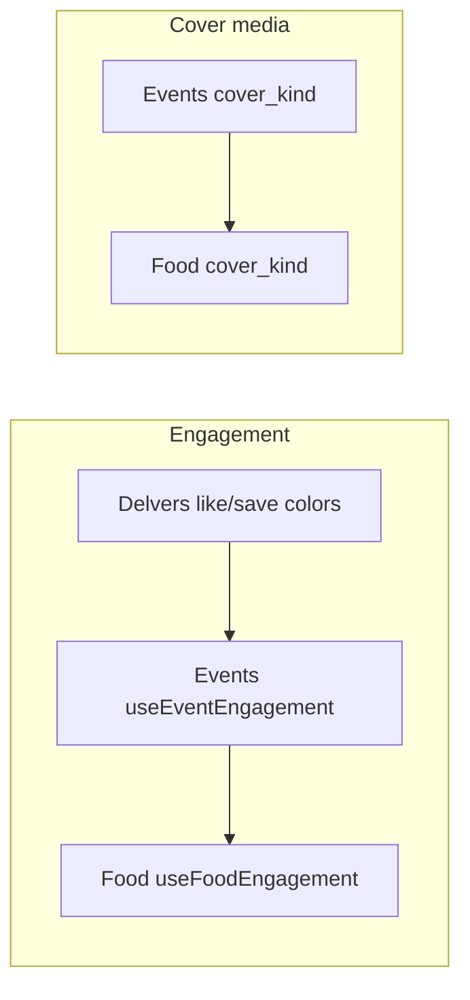

# Plan: Food Delvers-style like/save + video covers

**Status:** Implemented (2026-07-15)

**Goal:** Make food venue **like** and **save** work and look like Delvers (same red ♥ / gold bookmark language already used on Journeys & Events), and let providers set the venue **cover as either an image or a short video**.

**Reference (“developer space”):** Delvers post actions in `frontend/src/delvers.css` / `DelversSocial.tsx` — red `#ff3040` like, gold `#ffc107` save, pop animation. Events already mirrored this (`EventListingCard`, `EventDetailView`, `useEventEngagement`). Food is behind.

---

## Current gaps

| Area | Today | Target |
|------|--------|--------|
| List cards | Heart button toggles **save** only (`FoodListingCard`) | Separate **like** (Heart) + **save** (Bookmark), Delvers colors |
| Detail | Save only; engage bar has share/call/directions + bookmark — **no like** | Like + comments/share \| save like Events/Journeys |
| Backend | `FoodVenueSave` + `/save/` only | Add `FoodVenueLike` + `/like/` + `liked_by_me` / `likes_count` |
| Cover | `ImageField` + “Cover must be a photo”; gallery can be video | Cover may be image **or** video (same idea as Events `cover_kind`) |
| Display | Always `` via `foodCoverSrc` | `<video muted loop playsInline>` when cover is video; autoplay in view |

---

## Recommended approach

Mirror **Events** (closest sibling), not invent a third pattern.

### A. Likes + Delvers styling (Food list + detail)

**Backend**
1. Add `FoodVenueLike` model (same shape as `FoodVenueSave` / `EventLike`) + migration + unique `(venue, user)`.
2. In `backend/food/views.py` `FoodVenueViewSet`:
   - Annotate `likes_count`, `liked_by_me` (same pattern as saves).
   - Add `@action` `like` → POST toggle → `{ liked, likes_count }`.
3. Expose on `FoodVenueSerializer`: `liked_by_me`, `likes_count`.
4. Tests: extend `tests_food_saves.py` or add `tests_food_likes.py` (auth required, toggle, list annotation).

**Frontend**
1. Add `useFoodEngagement` (clone of `useEventEngagement.ts`) — optimistic overrides, login gate, share helper, busy flags for like+save.
2. **`FoodListingCard` / list UI**
   - Stop using Heart for save.
   - Under-media action row: Like · Share · Save (Bookmark), classes aligned with journeys (`jn-feed-card__action--like/save`) **or** keep food cards but apply Delvers active colors (`#ff3040` / `#ffc107`) + counts.
   - Wire from `FoodList.tsx` via engagement hook; guests → login.
3. **`FoodDetailView`**
   - Add like props; engage primary: **like · comments · share**; secondary: **save** (match `EventDetailView`).
   - Pass like into `JourneyHero` (already supports `liked` / `onLike`).
   - Mobile bar: like icon + save styling like journeys.
4. **CSS** (`food-detail.css`, `food-list.css`, `FoodCardsEnhancer.css`)
   - Active like → red; active save → gold (reuse journey rules under `.fd-detail-page` / list).
   - Fix enhancer so it doesn’t treat Heart-as-save; include like+bookmark buttons.
5. Deprecate/simplify DOM-hacking in `FoodCardsEnhancer` if React owns the action row (prefer React buttons over MutationObserver when touching this).

**Out of scope:** full social feed redesign of `/food` (modes, rails) — only engagement behavior + styling parity.

### B. Cover = image or video

**Backend** (follow `events_app` migrations `0012`/`0013`)
1. Migrate `FoodVenue.cover_image` from `ImageField` → `TextField` (URL/path; video URLs can exceed 100 chars).
2. Add `cover_kind` (`image` | `video`, default `image`).
3. Data migration: copy existing `ImageField` name/URL into text; infer `cover_kind=image`.
4. Provider serializer:
   - Accept cover upload as **FileField** (image or video), or `cover_image_url`.
   - On video: store remote/local URL in `cover_image`, set `cover_kind=video`; still sync `photos` cover entry with `"kind": "video"`.
   - On image: `cover_kind=image`.
   - Infer kind from content-type / extension / URL (same helpers events use).
5. Public serializer: return `cover_image` URL string + `cover_kind`.
6. Tests: create/update venue with video cover URL and video file (mirror `events_app/tests.py` video cover cases).

**Frontend provider**
1. `FoodVenuePhotoEditor`: pass `allowVideoCover` into `ListingPhotoManager`; update hint to match events (“Cover can be a photo or short clip…”).
2. `foodVenueFormData` / types: ensure video cover file is sent as `cover_image` (or dedicated field if backend names it); track `cover_kind` if needed.
3. Module copy: “Cover photo” → “Cover photo or video” in `foodVenueModules.ts`.

**Frontend display**
1. Types (`FoodCardVenue`, list/detail venue types, `foodDisplay`/`foodListing`): add `cover_kind?: 'image' | 'video'`.
2. `FoodListingCard` (+ featured/spot cards if separate): if video → `<video muted loop playsInline>` + IntersectionObserver autoplay (copy `EventListingCard`).
3. Detail hero gallery: include video cover in `buildFoodGalleryImages` / hero media so `JourneyHero` can show video (or short-circuit first media as video). Check how journey/event heroes render video; reuse that path.
4. Fallbacks: cuisine placeholder only for missing/broken **image** covers; for video, keep poster optional.

---

## Implementation order

1. Backend likes model + API + serializer fields + tests  
2. Frontend engagement hook + list/detail UI + Delvers CSS  
3. Backend cover text + `cover_kind` migration + provider upload  
4. Provider photo editor `allowVideoCover`  
5. List/detail video cover rendering  

---

## Critical files

**Likes / styling**
- `backend/food/models.py`, `views.py`, `serializers.py`, new migration, tests
- `frontend/src/hooks/useFoodEngagement.ts` *(new)*
- `frontend/src/hooks/useFoodSave.ts` *(fold into engagement or keep as thin wrapper)*
- `frontend/src/pages/FoodList.tsx`, `FoodDetail.tsx`
- `frontend/src/components/food/FoodListingCard.tsx`, `FoodDetailView.tsx`
- `frontend/src/components/food/food-list.css`, `food-detail.css`, `FoodCardsEnhancer.tsx` / `.css`

**Video covers**
- `backend/food/models.py`, `provider_serializers.py`, `provider_views.py`, `serializers.py`, migrations, tests
- `frontend/src/components/provider/food/FoodVenuePhotoEditor.tsx`, `foodVenueTypes.ts`, `foodVenueFormData.ts`, `foodVenueModules.ts`
- `frontend/src/components/food/FoodListingCard.tsx`, `FoodDetailView.tsx`
- `frontend/src/utils/foodDisplay.ts` / food listing helpers
- Pattern refs: `backend/events_app/models.py`, `EventForm.tsx`, `EventListingCard.tsx`, `ListingPhotoManager.tsx` (`allowVideoCover`)

---

## Verification

1. **Like/save (auth):** On `/food` and `/food/:id`, like toggles red heart + count; save toggles gold bookmark; refresh keeps state; logged-out click → login.
2. **API:** `POST /api/food/venues/:id/like/` and `/save/` return correct flags/counts; list payload includes `liked_by_me` / `likes_count`.
3. **Provider cover:** In food venue photos module, upload a short mp4 as cover; save; public list/detail show muted looping video; upload image cover still works.
4. **Regression:** Gallery videos still work; existing image covers still render after migration.
5. Manual: open Delvers post + food detail side by side — like/save colors and hierarchy should feel the same.

