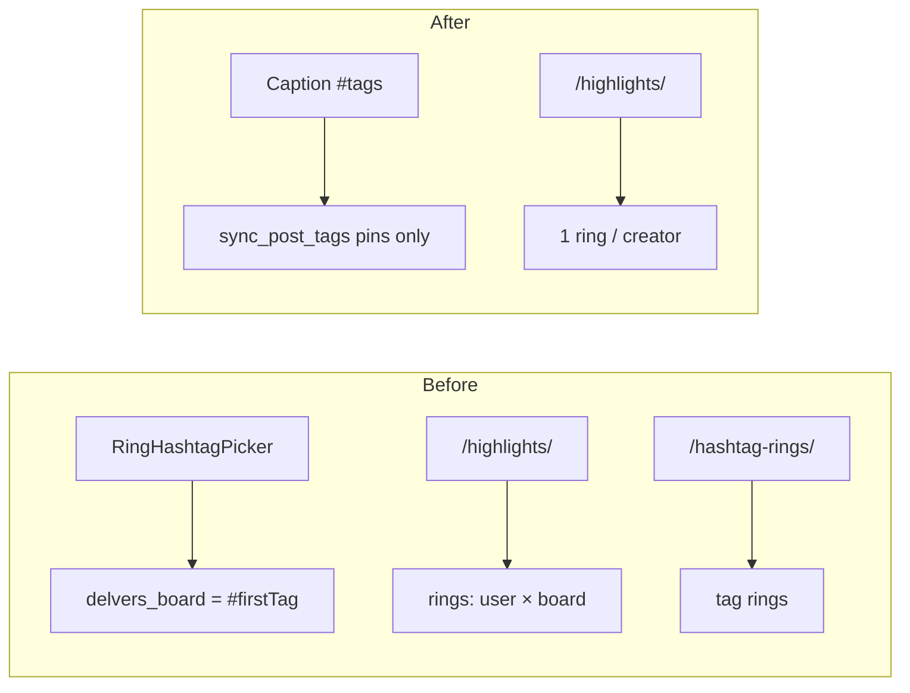

# Plan: Instagram-style Highlights + caption hashtags on posts

## Goal

Stop treating hashtags as highlight/board identity. Match Instagram/TikTok:

- **Highlights** = one story ring per creator (not `#safari` boards / global hashtag rings).
- **Posts** = normal captions with `#hashtags` for search/discovery.

Provider listing highlights (`components/highlights/*`) stay out of scope.

## Product locks

| Area | Behavior |
|------|----------|
| Highlight ring | One ring per author; label always `Highlights` |
| `delvers_board` on highlights | Always `"Highlights"` (coerce + migrate) |
| Create flows | Keep `/create/highlight` + “Also save as a highlight…” |
| Post hashtags | Caption/body only → existing `sync_post_tags` |
| Hashtag / place rings on Delvers shelf | Remove |
| `TagFollow` / hashtag-ring follow | Remove |
| Pin `delvers_board` (non-highlight) | Leave as-is (`Posts`, Journeys, similar-by-board) |

## Implementation order

### 1. Backend: coerce + migrate highlight boards

- **`backend/social/serializers.py`**: when creating/updating a highlight, force `attrs["delvers_board"] = "Highlights"`.
- **Migration `0019_normalize_highlight_delvers_board`**: set all `is_delvers_highlight=True` rows to `delvers_board="Highlights"`. Do **not** touch non-highlight pins.
- Light docstring/help-text cleanup on `delvers_board` / `delvers_highlights.py`.

### 2. Backend: remove hashtag-ring APIs

- Delete `DelversHashtagRingsView` + `DelversTagFollowToggleView` from `views.py`.
- Remove routes in `urls.py`: `delvers/hashtag-rings/`, `delvers/tags/<slug>/follow/`.
- Delete `TagFollow` model + migration `0020_delete_tagfollow`.
- Delete or replace `tests_delvers_hashtag_rings.py` with coerce + 404 smoke tests.
- **Keep** `GET /api/social/delvers/highlights/` and `sync_post_tags` behavior (highlights stay unindexed).

### 3. Frontend: composer

**`SocialCreateComposer.tsx`**
- Remove `RingHashtagPicker` / `ringHashtags` and any ring→body merge.
- `bodyText = caption.trim()` only.
- `delversBoard: publishAsHighlight ? "Highlights" : (postsToDelvers ? "Posts" : undefined)`.
- For Delvers **pins** (not highlight-only publish), improve caption hashtag UX: swap/wire `HashtagTextarea` into `CaptionEditor` (or only when `postsToDelvers && !publishAsHighlight`) so `#tags` stay first-class like IG.
- Keep story mode + “Also save as highlight”.

**Delete** `RingHashtagPicker.tsx` and related CSS (`.create-ring-tags*`).

**`PublishQueueContext.tsx`**: no structural change beyond whatever board string callers send.

### 4. Frontend: Delvers shelf + viewer

**`delversHighlightRings.ts`**
- `buildBoardRings`: group by **`author.username` only**; force label + `boardRingKey(..., "Highlights")`.
- Remove `buildPlaceRings`, `mapHashtagRing`, tag/place queue kinds.

**`delversHighlightSeen.ts`**
- Keep `boardRingKey`; drop unused `tagRingKey` / `placeRingKey`.
- One-time migrate seen map: merge `board:{user}:*` → `board:{user}:highlights`; drop `tag:*` / `place:*`; fold deprecated `creator:{user}`.

**`DelversSocial.tsx`**
- Drop hashtag-rings query, tag-follow mutation, place/tag shelf UI.
- Stories row = Create bubble + creator Highlights rings only.

**`DelversStoryViewer.tsx`**: drop tag-follow chrome; board/highlight-only viewer.

**`mockApi.ts`**: remove hashtag-rings + tag-follow handlers.

Leave `components/highlights/**` alone.

### 5. Compatibility

- FE groups by username **even before** DB migration so old `#tag` boards still collapse into one creator ring.
- Serializer coerce is source of truth for new writes.
- Seen-key migrate avoids every ring looking unread after ship.

## Critical files

| File | Change |
|------|--------|
| `backend/social/serializers.py` | Coerce highlight board |
| `backend/social/migrations/0019_…` | Normalize highlight boards |
| `backend/social/views.py` / `urls.py` | Remove hashtag-rings + tag follow |
| `backend/social/models.py` + `0020_…` | Delete `TagFollow` |
| `frontend/.../SocialCreateComposer.tsx` | Drop ring hashtags; caption-only tags |
| `frontend/.../CaptionEditor.tsx` | Hashtag-friendly caption for pins |
| `frontend/.../RingHashtagPicker.tsx` | Delete |
| `frontend/.../delversHighlightRings.ts` | One ring / creator |
| `frontend/.../delversHighlightSeen.ts` | Seen migrate |
| `frontend/.../DelversSocial.tsx` | Shelf cleanup |
| `frontend/.../DelversStoryViewer.tsx` | Drop tag follow |
| `frontend/.../mocks/mockApi.ts` | Mock cleanup |

## Verification

1. Create highlight → appears in one **Highlights** ring for that user; not in main Delvers pin feed.
2. Create pin with `#namibia #food` in caption → searchable/tag-indexed; **no** hashtag ring bubble.
3. “Also save as highlight” merges into same creator Highlights ring.
4. Two authors → two rings. Existing multi-`#board` highlights collapse to one per author.
5. After refresh, seen state still sensible (migrate).
6. Journeys / pin `delvers_board` and provider highlight studio unchanged.
7. Automated: migrate assert, serializer coerce, removed URLs 404, pin tags indexed / highlight not, `buildBoardRings` one-per-username.

## Risks

- Regrouping without seen migrate → false “unread” rings → **require** seen migrate.
- Accidentally normalizing pin boards → only filter `is_delvers_highlight=True`.
- Removing picker without caption `#` assist → wire `HashtagTextarea` on Delvers posts.
