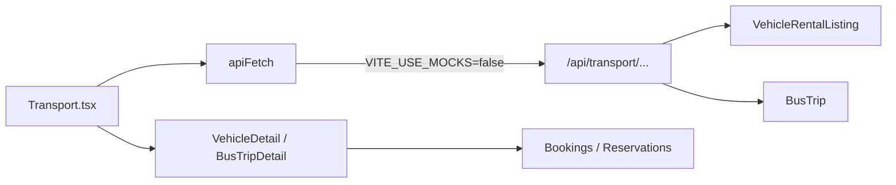

# Connect Transport marketplace to Django backend

**Goal:** Make the Transport page load vehicles and shared rides from the real Django API (not in-browser mocks), with filters that hit the backend, and detail/booking verified against the same API.

**Finding:** `Transport.tsx` already calls `GET /api/transport/vehicles/` and `GET /api/transport/bus/trips/` via `apiFetch`. Locally it still uses mocks because `frontend/.env.development` sets `VITE_USE_MOCKS=true`.

**Out of scope this pass:** Food-style save/like models and APIs for transport (local bookmark UI can stay). Provider admin is already on provider endpoints.

---

## Approach

Flip the frontend to the real API, harden list fetching to match Food/Accommodation (`asArray`, server-side search/filters), small backend filter gaps only if needed, then verify with Django running and real listings.



---

## 1. Point Vite at Django

Create `frontend/.env.development.local` (gitignored; overrides `.env.development`):

```
VITE_USE_MOCKS=false
VITE_API_URL=http://127.0.0.1:8000
```

Restart `npm run dev` after changing env. Keep Django on `:8000` with migrations applied.

Do **not** commit a permanent change to `.env.development` unless the team wants mocks off by default for everyone.

---

## 2. Harden `Transport.tsx` list fetching

**File:** `frontend/src/pages/Transport.tsx`

| Change | Why |
|--------|-----|
| Wrap list responses with `asArray()` from `api/client` | Same defensive pattern as Accommodation; survives paginated/unexpected envelopes |
| Send `search` as DRF `search=` on vehicles when query present | Backend already has `search_fields` on vehicles; stop filtering search only in the browser |
| Send `min_price` / `max_price` on bus trips when set | Backend `BusTripFilter` already supports them; More filters currently only apply to vehicles |
| Map area chip to `city=` (or `search=`) when possible | API supports exact `city`; keep light client fallback for airport labels that aren’t city fields |
| Keep need-chip heuristics mostly client-side | Mood filters (family / week / coastal shortcuts) mirror Food’s client refinement pattern |
| Keep sort client-side | Bus viewset has no `ordering_fields`; vehicles can optionally use `ordering=` later |

Query keys stay `['veh', vQs]` / `['bus', bQs]` so React Query refetches when params change.

---

## 3. Small backend gaps (only if needed for browse)

**File:** `backend/transport/views.py` — `BusTripViewSet`

- Add `search_fields` on route origin/destination / operator name so marketplace search works for shared rides too (vehicles already searchable).

**File:** `backend/transport/filters.py` — optional

- No change required for current UI params; already has origin/dest/date/price.

**Serializers:** Do not add save/like fields in this pass. If VehicleDetail booking UI breaks on missing docs fields, expose stubs from serializer only as a follow-up (provider stubs already return empty docs in places).

---

## 4. Ensure data exists in Django

Marketplace will look empty if DB has no active listings.

1. Run migrations: `python manage.py migrate`
2. Create/activate at least one provider vehicle (`is_active=True`) via Transport Admin UI or Django admin / shell
3. Create at least one active bus trip with origin/destination in the near future
4. Confirm APIs return arrays:

```
GET http://127.0.0.1:8000/api/transport/vehicles/
GET http://127.0.0.1:8000/api/transport/bus/trips/
```

No new seed command required unless the team wants one; provider publish path is the product path.

---

## 5. Detail + booking (verify, minimal code)

Already wired; only fix if broken against live serializers:

| Page | Endpoints |
|------|-----------|
| `VehicleDetail.tsx` | `GET /vehicles/{id}/`, `POST /vehicle-bookings/`, `POST .../mock_pay/` |
| `BusTripDetail.tsx` | `GET /bus/trips/{id}/`, `POST /bus/reservations/`, pay endpoints |

Confirm `mediaUrl` resolves cover images from Django/media or absolute URLs.

---

## 6. Explicitly not in this pass

- Transport save/like DB models, endpoints, `saved_by_me` (would mirror food — separate feature)
- Replacing local `savedIds` with API persistence
- Wiring `FeaturedTransport` / promotions rail (optional follow-up)
- Rewriting provider `TransportAdmin` (already uses provider APIs)

---

## File-by-file

| File | Action |
|------|--------|
| `frontend/.env.development.local` | **Create** — `VITE_USE_MOCKS=false`, `VITE_API_URL` |
| `frontend/src/pages/Transport.tsx` | `asArray`, push `search` (+ bus prices / city) into querystrings; trim redundant client filters where API covers them |
| `backend/transport/views.py` | Add bus trip `search_fields` (small) |
| `frontend/src/mocks/mockApi.ts` | Optional: keep parity for search/price on trips when mocks re-enabled |
| Detail pages | Touch only if live response breaks UI |

---

## Test plan

- [ ] Django running; `VITE_USE_MOCKS=false`; Vite restarted
- [ ] `/transport` loads vehicles and/or trips from DB (Network tab shows `127.0.0.1:8000`, not mock)
- [ ] Region / min-max price / seats / vehicle type refetch vehicles
- [ ] Trip from/to / travel date refetch bus trips
- [ ] Search returns matching vehicle titles/makes (and trips after search_fields)
- [ ] Rent vs share modes only request the relevant endpoint
- [ ] Empty DB → empty state UI, not crash
- [ ] Open vehicle + bus detail; covers render; booking POST works when signed in + email verified
- [ ] With mocks re-enabled (`true`), marketplace still works offline for local UI work
