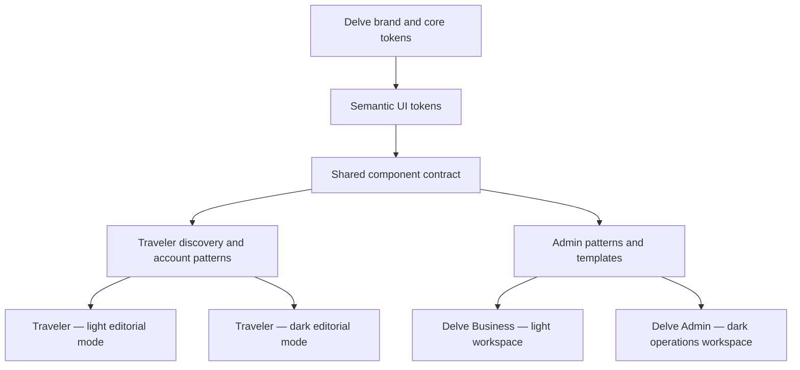
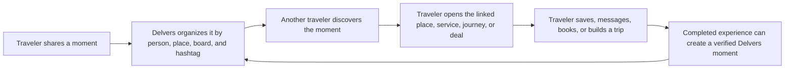

# Delve Product & Manage Design System

> **Status:** Draft v0.2  
> **Date:** 6 August 2026  
> **Audience:** Product, design, engineering, Cursor, and Figma AI  
> **Scope:** Traveler discovery and account experiences, Delve Business administration, and Delve platform administration  
> **Design source:** This draft records the proposed target system. It does not mean every rule is already implemented.

## 1. Purpose

Delve needs one product language that can serve three connected environments:

1. **Traveler app** — the public and signed-in experience used to discover places, services, deals, Delvers, and Journeys, then manage identity, bookings, orders, and payments.
2. **Delve Business** — the business/provider console used by travel businesses to manage listings, bookings, messages, questions, reviews, deals, boosts, payouts, analytics, and settings.
3. **Delve Admin** — the internal console used by Delve staff to manage users, businesses, verification, listings, bookings, payments, disputes, content, safety, merchandising, analytics, and platform settings.

The system should make all three environments feel unmistakably Delve while preserving the different needs and permissions of their users. Delve Purple is the primary brand and interaction color across all surfaces.

The design system is intended to be:

- readable as a product and UI specification;
- usable as context for Cursor before it changes either React application;
- pasteable into Figma AI as a structured generation brief;
- suitable for future conversion into Figma variables, design tokens, and shared code components;
- strict enough to reduce one-off styling and duplicated components.

## 2. Existing product mapping

| Product name in this document | Existing implementation | Main route | Primary users |
| --- | --- | --- | --- |
| Delve Business | `frontend/src` | `/provider` | Business owners, managers, and staff |
| Delve Admin | `Delve Admin/src` | `/admin` | Delve platform staff |
| Traveler app | `frontend/src` | Consumer routes | Travelers and the public |

Important implementation facts:

- Both admin experiences use React, TypeScript, Vite, React Router, TanStack Query, and Lucide icons.
- Delve Business is part of the Traveler application and currently uses “provider” in routes, APIs, and component names.
- Delve Admin is a separate application and authentication surface.
- The Traveler route `/admin/*` is only a handoff to Delve Admin. It is not a third admin product.
- This design system does not rename working routes, API objects, database concepts, or existing permissions without a separate migration plan.

## 3. System idea: one system, four surface modes

The system shares one foundation and one component contract, then applies a surface mode.



### Traveler: light and dark editorial modes

The Traveler app should feel visual, local, useful, and human in both light and dark themes. Traveler Light uses the warm cream Delve foundation; Traveler Dark uses a deep warm-black canvas with raised charcoal surfaces. Both use Delve Purple for search, save, follow, create, booking, payment, focus, links, selection, and theme control. Commerce and social content remain clearly distinguishable.

The experience should feel like a knowledgeable local guide connected to a trustworthy marketplace—not a generic booking grid or an endless social feed.

Theme behavior:

- offer Light, Dark, and System choices in Account/Settings and a compact accessible toggle where product navigation allows it;
- default to the operating-system preference for a new user;
- persist the explicit choice for signed-out and signed-in use, then reconcile safely with account preference when available;
- switch semantic variables rather than maintaining separate page designs or scattered dark-mode overrides;
- keep content order, meaning, component anatomy, status language, and interaction behavior identical across themes;
- select image overlays, borders, maps, charts, skeletons, focus, and media controls for the active theme;
- never invert or recolor listing, profile, Journey, Delvers, driver, or vehicle media;
- prevent theme flash during startup where the application architecture supports early preference application;
- test every primary Traveler page at 1440px and 390px in both themes.

### Delve Business: light workspace

Delve Business should feel calm, clear, and commercially focused. It uses a warm cream canvas, white cards, dark ink text, and Delve Purple for primary actions, active navigation, links, focus, and selected controls.

The experience should feel like a modern hospitality ledger: welcoming enough for small businesses, structured enough for multi-location operators.

### Delve Admin: dark operations workspace

Delve Admin should feel focused, trustworthy, and efficient. It uses a deep brown-black canvas, raised charcoal surfaces, warm off-white text, and Delve Purple for primary actions, active navigation, links, focus, and selected controls.

The experience should feel like an operations desk, not a generic analytics dashboard. Urgent queues, audit history, and decision context take priority over decorative charts.

## 4. Product principles

### 4.1 Attention before analytics

The first screen answers “What needs action?” before showing broad performance data. Important queues are visible, ordered, and actionable.

### 4.2 One object, one status, one next action

Rows and cards should make the object, current state, and best next action immediately clear. Avoid collections of equally weighted buttons.

### 4.3 Progressive complexity

Small businesses see a simple daily workflow. Advanced tools appear when the user has multiple businesses, categories, locations, team members, or higher-volume operations.

### 4.4 Decisions need context

Verification, payment, moderation, dispute, and suspension actions show the evidence, history, consequence, and audit requirement before the final action.

### 4.5 Purple signals Delve interaction

Delve Purple is used consistently for primary actions, focus, links, active navigation, and selected controls. Status colors retain their semantic meaning and never compete with purple as a brand color.

### 4.6 Never rely on color alone

Status always includes a written label. Critical status also includes an icon or supporting message.

## 5. Product naming and language

### Preferred product terms

| Use | Avoid in user-facing copy | Notes |
| --- | --- | --- |
| Delve Business | Provider portal, service-provider admin | Existing code can continue to use `provider` |
| Delve Admin | Platform backend, super admin | “Platform console” can appear as a supporting label |
| Traveler app | Customer frontend | Use “traveler” in product copy unless the brand chooses British spelling globally |
| Boost | Promotion | “Promotion” can remain an internal/API term |
| Business | Provider | Use “provider” only where a legal or category distinction requires it |
| Needs attention | Alerts center | Use for actionable operational work |
| Request changes | Reject | Use when the business can correct and resubmit |

### Voice

- Direct, calm, and specific.
- Use verbs for actions: “Review verification”, “Publish listing”, “Release payout”.
- Name consequences: “Suspending this business hides 12 active listings.”
- Avoid blame, jargon, and vague confirmation copy.
- Use sentence case for headings, buttons, tabs, labels, and navigation.
- Use local currency formatting in realistic examples: `N$ 48,620.00`.

## 6. Users and permissions

The roles below are the target UI model. Current backend permissions may be simpler and must remain authoritative until role-based access is implemented.

### Delve Business roles

| Role | Intended access |
| --- | --- |
| Owner | All business tools, billing/payouts, team access, business deletion, and ownership transfer |
| Manager | Listings, bookings, messages, questions, reviews, boosts, analytics, and most business settings |
| Staff | Assigned operational tools such as bookings, messages, and guest support |
| Analyst | Read-only access to listings, bookings, reviews, and analytics |

### Delve Admin roles

| Role | Intended access |
| --- | --- |
| Super admin | All platform tools and permission management |
| Trust & Safety | Verification, reports, reviews, moderation, disputes, and safety actions |
| Finance Ops | Payments, held payouts, refunds, disputes, and commerce reporting |
| Content Ops | Listings, boosts, merchandising, home content, and editorial tools |
| Support | User, business, booking, and case inspection with limited actions |
| Analyst | Read-only analytics, activity, and export access |

### Permission behavior

- Hide navigation that the user can never access.
- Show a disabled action with an explanation when seeing it is useful for understanding a workflow.
- Do not expose protected data and then rely only on disabled controls.
- For unavailable actions, explain which role can perform the action.
- Re-authentication is recommended for ownership transfer, payout-detail changes, role changes, suspension, and irreversible deletion.

## 7. Information architecture

### 7.1 Delve Business navigation

**Overview**

- Overview

**Operate**

- Listings
- Bookings
- Messages
- Questions
- Reviews

**Grow**

- Deals & rates
- Delvers content
- Boost
- Analytics

**Categories**

- Stays
- Guides
- Transport
- Food & drink
- Shop
- Activities
- Events

Only categories connected to the active business are shown.

**Business**

- Public business profile
- Team and access — target feature
- Settings

Multi-business switching stays near the top of the sidebar. The active business must be visible on every page.

### 7.2 Delve Admin navigation

The current long list should become grouped navigation.

**Overview**

- Dashboard
- Analytics
- Activity

**Supply**

- Verifications
- Businesses
- Listings

**Commerce**

- Bookings
- Payments
- Disputes
- Deals
- Boosts
- Boost packages

**Community & content**

- Delvers
- Journeys
- Reports
- Reviews
- Content moderation

**Merchandising**

- Home pins
- Explore places
- Home stories

**People & access**

- Users
- Email verification

**System**

- Settings

On compact screens, navigation uses a modal drawer. Groups remain labeled and collapsible. The currently active group opens automatically.

### 7.3 Deals as a cross-service discovery layer

Helping travelers find genuine value across different services is a core Delve journey, not a secondary promotion feature. Deals should connect stays, food and drink, guides, transport, events, activities, and shops through one normalized discovery experience.

The product promise is:

> **Find a better way to experience a place within your budget, across the whole trip.**

Delve already has two useful deal sources:

- **Business travel offers** — resident rates, student rates, local rates, discounts, and packages attached to a business and one or more service categories.
- **Listing sales** — a specific discounted price attached to one listing.

The first implementation step should not be a risky database rewrite. Cursor should preserve `TravelOffer` and `ListingSale`, then normalize both through one shared discovery contract and one visual component family.

#### Normalized deal contract

Every discoverable deal should expose these concepts, even when the underlying source stores them differently:

| Group | Required information |
| --- | --- |
| Identity | Deal ID, source type, business, listing when applicable, service category |
| Value | Deal kind, original price when verifiable, current price, currency, savings amount/percentage, price unit |
| Audience | Everyone, SADC resident, local, student, age range, party-size rule, custom audience |
| Availability | Start, end, timezone, book-by date, travel/use dates, inventory or capacity when available |
| Place | Country, region, city, coordinates when available |
| Claim | Direct booking, code, message business, show proof, external ticket, or other explicit method |
| Trust | Verified business, proof required, terms, exclusions, fees, cancellation rule, last updated |
| Governance | Draft, scheduled, active, paused, expired, rejected; moderation and feature state |
| Measurement | Impressions, opens, saves, claim starts, bookings, conversion, attributed revenue |

#### Traveler journey

Deals should be discoverable from multiple contexts without creating separate disconnected catalogues:

1. **Home and Explore rails** — personalized but diverse deals near the active destination.
2. **Global search** — deals appear as a result type alongside services and businesses.
3. **Deals hub** — one cross-service browse page for intentional deal discovery.
4. **Service lists** — “Deals available” filter for stays, food, transport, guides, events, activities, and shops.
5. **Listing and business pages** — relevant deal badges and full claim details near pricing or booking actions.
6. **Saved deals and alerts** — target feature for expiry, destination, and price notifications.
7. **Trip building** — later phase that combines compatible stay, transport, activity, event, and food deals into a budget-aware itinerary.

The Deals hub should support:

- destination or “near me”;
- travel/use dates;
- service category;
- total budget or price range;
- deal type: sale, discount, resident/local rate, student rate, or package;
- “I may qualify” personalization;
- party size;
- verified businesses only;
- ending soon, newest, highest real savings, and recommended sorting.

#### Deal-card information hierarchy

Every cross-service `DealCard` should answer these questions in order:

1. What is the experience or product?
2. What is the genuine value?
3. Which service category is it?
4. Where is it?
5. Who qualifies?
6. When is it available or when does it end?
7. Which verified business offers it?

The card should show image, short deal label, title, business, place, service category, eligibility, current price or savings, and expiry when relevant. Use Delve Purple for the primary action and selection. A restrained gold may emphasize a verified saving, but the whole card should not become a bright sale banner.

#### Deal detail and claim flow

Opening a deal should reveal:

- the complete value and what is included;
- original and current price when both can be verified;
- eligible audience and required proof;
- applicable listings or service categories;
- booking/use dates and expiry;
- exclusions, fees, cancellation terms, and limited inventory;
- numbered claim steps;
- the business and verification state;
- a clear primary action such as “Book this rate”, “Message business”, or “View listing”.

Use “May qualify” until Delve has enough verified profile information to make a stronger eligibility statement. Never expose private profile attributes to businesses through the deal UI.

#### Trust rules

- Do not show a strike-through price unless the business supplied a genuine recent reference price and the current price is lower.
- Show the total traveler-facing price and unavoidable fees as early as the service allows.
- Do not use fake countdowns, false scarcity, or automatically renewed “limited” deals.
- Expired deals must disappear from discovery promptly and remain visible to the business as expired history.
- Terms and claim instructions must be available before the user commits.
- Clearly distinguish “Save 20%”, “From N$ 800”, “Resident rate”, and “Package”; these are not interchangeable.
- Verified-business status and deal-validation status are separate concepts.
- Platform staff need an audit trail for price, date, eligibility, and terms changes.

#### Ranking and diversity

Deal ranking should first enforce hard eligibility and availability rules, then score useful matches.

Recommended order of signals:

1. Active dates, destination, service availability, and inventory.
2. User eligibility or possible eligibility.
3. Search intent, saved interests, and active trip context.
4. Genuine savings and price fit.
5. Distance or destination relevance.
6. Business trust, listing quality, and service reliability.
7. Freshness and traveler engagement.

Apply diversity limits so one large business or one service category does not occupy the entire first screen. Sponsored placement must be labeled and cannot bypass safety, availability, or trust requirements.

#### Delve Business workflow

Add a dedicated **Deals & rates** destination under Grow. Existing offer creation currently lives within business settings; the target system should give it a focused workspace.

The business workflow should support:

1. Choose deal type.
2. Attach one or more listings/categories.
3. Define price/value, audience, dates, inventory, proof, claim method, and terms.
4. Preview the exact traveler card and detail experience.
5. Run automatic quality and trust checks.
6. Publish now or schedule.
7. Pause, duplicate, edit, or end the deal.
8. View impressions, opens, saves, claim starts, bookings, conversion, and revenue.

Listing-specific sales can remain inside listing editors, but should also appear in the unified Deals & rates workspace.

#### Delve Admin workflow

Add **Deals** to the Commerce navigation group. The platform workspace should provide:

- all active, scheduled, paused, rejected, and expired deals;
- filters by service, destination, business, eligibility, date, and source type;
- suspicious reference-price and extreme-discount flags;
- missing terms, unclear claims, expired inventory, and duplicate deal checks;
- inspection of the linked business and listings;
- approve, request changes, pause, reject, and feature actions where policy requires review;
- editorial collections such as “Weekend under N$ 2,000” or “SADC resident rates”;
- full audit history and performance reporting.

#### Deal components

Add these components to the shared contract:

| Component | Purpose |
| --- | --- |
| `DealCard` | Normalized cross-service discovery result |
| `DealBadge` | Short type/value label; never the only explanation |
| `DealPrice` | Current price, reference price, savings, currency, and unit |
| `DealEligibility` | Audience, possible qualification, and required proof |
| `DealAvailability` | Start/end, book-by/use dates, and remaining inventory |
| `DealClaimSteps` | Numbered path to unlock or book the deal |
| `DealTrustPanel` | Business verification, terms, exclusions, fees, and update time |
| `DealEditor` | Business creation and scheduling workflow |
| `DealPreview` | Exact traveler-facing card/detail preview before publishing |
| `DealPerformance` | Impressions-to-booking funnel and attributed value |
| `DealReviewQueue` | Platform quality, pricing, trust, and policy review |

#### Deal success measures

The primary measure is completed value, not card clicks.

- travelers who find at least one relevant deal;
- deal save and claim-start rate;
- deal-attributed booking conversion;
- total traveler savings based on verified reference prices;
- incremental revenue for participating businesses;
- cross-service discovery rate;
- expired, misleading, rejected, and reported-deal rate;
- diversity of businesses and service categories receiving discovery.

#### Delivery sequence

**Phase A — unify and trust**

- Normalize existing travel offers and listing sales in one discovery contract.
- Standardize `DealCard`, pricing, eligibility, terms, expiry, and claim patterns.
- Make the Deals hub consistent across every supported service.
- Add a dedicated Delve Business Deals & rates workspace.
- Add a basic Delve Admin deal registry and audit view.

**Phase B — relevance and measurement**

- Improve destination/date/budget filtering and ranking.
- Add saves, alerts, analytics events, and deal-attributed bookings.
- Add automatic pricing, expiry, terms, and duplication checks.

**Phase C — whole-trip value**

- Recommend compatible deals from different services.
- Create budget-aware trip collections and itineraries.
- Test transparent cross-service packages without hiding individual prices or terms.

### 7.4 Delvers as the social discovery layer

Delvers is the human layer of Delve: a visual travel network where people discover places, services, deals, and trip ideas through real experiences shared by travelers, creators, and businesses.

It should not behave like a generic social feed that is disconnected from the marketplace. Its product purpose is:

> **Turn authentic travel moments into useful local discovery and confident action.**

The core loop is:



#### Existing Delvers foundation

Delve already supports much of this layer:

- a dedicated `/delvers` feed;
- image, video, and carousel posts;
- persistent Delvers posts and short-lived highlights;
- creator, board, place, and hashtag highlight rings;
- regional and personalized discovery;
- likes, saves, fire reactions, comments, sharing, and follows;
- linked stays, events, food venues, guides, vehicle rentals, bus trips, and journeys;
- verified moments connected to completed experiences in supported services;
- reporting, moderation, hidden-content states, and moderation reasons;
- clearly modeled sponsored Delvers feed placements.

The design system should unify these capabilities and make their connection to marketplace discovery explicit.

#### Delvers content types

| Content type | Purpose | Required labeling |
| --- | --- | --- |
| Moment | Persistent photo, video, or carousel from a traveler or creator | Author, place/region, time, linked service when present |
| Verified moment | Experience linked to qualifying completed activity or booking | “Verified experience” plus the linked service |
| Highlight | Lightweight story-style update organized by creator, board, place, or hashtag | Author/source and highlight context |
| Journey share | A journey, stop, or reflection shared into Delvers | Journey title and linked stop/place |
| Business content | Useful visual content posted by an identifiable business/team member | Business identity; never presented as an independent traveler review |
| Sponsored post | Paid distribution of eligible Delvers content | Persistent “Sponsored” label and advertiser identity |
| Sponsored listing | Paid marketplace card injected into the feed | “Sponsored listing” and service category |

Business content, sponsored content, and independent traveler content must remain visually related but clearly distinguishable.

#### Traveler journey

Delvers should support these user goals:

1. See what a destination or experience really feels like.
2. Discover places and services that may not rank highly in a traditional catalogue.
3. Follow trusted travelers, creators, businesses, places, boards, and hashtags.
4. Save moments for a future trip.
5. Ask or answer practical questions in context.
6. Open the linked listing, business, journey, event, or deal.
7. Book, message, or add the discovery to a trip.
8. Share a verified moment after a completed experience where verification is supported.

Primary discovery views should include:

- For you;
- Nearby or active destination;
- Following;
- Trending;
- Reels/video;
- creator highlights;
- place highlights;
- board highlights;
- hashtag highlights.

“For you” should never become an unexplained black box. The interface can use short context such as “Popular near Windhoek”, “Because you saved food experiences”, or “From a creator you follow”.

#### Marketplace and service links

A Delvers post can become useful discovery when it contains a trustworthy contextual link.

Supported and target links include:

- stay;
- food venue;
- guide;
- vehicle rental;
- bus trip;
- event;
- activity;
- shop or product;
- business profile;
- journey or journey stop;
- deal.

The linked object appears as a compact `PlaceChip`, `ServiceChip`, `JourneyChip`, or `DealChip`, not as a large advertisement that hides the post.

Opening the chip should preserve the ability to return to the same feed position. The destination page should show a “From Delvers” section with relevant moments, subject to privacy and moderation rules.

#### Delvers and deals

Deals can be discovered through Delvers, but commercial content must remain transparent.

- A traveler moment may link to an active deal available for the featured service.
- A business may publish an eligible Delvers post and sponsor it through the existing promotion workflow.
- A sponsored deal or listing inserted into Delvers must be labeled from the first impression.
- Independent traveler posts should never be converted into business advertising without the creator’s explicit permission.
- A deal attached to a post inherits the deal’s eligibility, expiry, price, terms, and trust requirements.
- Expired deals disappear from the post action while the original moment remains available.
- Ranking must not allow sponsored content to crowd out organic travelers or smaller local businesses.

The preferred conversion path is:

`Moment → linked service/deal → detail and trust information → save/message/book`

#### Feed ranking and diversity

Recommended organic ranking signals:

1. Visibility and privacy eligibility.
2. Active destination or regional relevance.
3. Followed creators and followed hashtags.
4. Linked service, saved interests, and trip context.
5. Verified-experience signal where available.
6. Saves, meaningful comments, and helpful engagement.
7. Recency and content quality.

Use likes and reactions as supporting signals rather than the sole definition of quality. Apply creator, business, place, service-category, and sponsored-placement diversity limits.

Never rank hidden, processing-failed, policy-restricted, or unavailable content. Sponsored items must pass the same safety and availability checks as organic discovery.

#### Trust, privacy, and safety

- Respect private-account visibility on every feed, permalink, profile, search, ring, and related-content surface.
- Do not disclose a traveler’s booking, proof, age, nationality, or eligibility data through a post.
- “Verified experience” confirms a qualifying Delve-linked experience; it is not an endorsement of every statement in the post.
- Show business and sponsored identity clearly.
- Provide report, block, mute, and unfollow controls in predictable locations.
- Remove hidden content consistently from feeds, profiles, search, related content, rings, and destination “From Delvers” sections.
- Preserve moderation evidence and audit history for authorized staff.
- Use reason categories and an appeal path for meaningful account or content actions.
- Do not support user-uploaded standalone music or audio files. Media remains image or video, consistent with Delve’s content policy.
- Provide processing, failed-upload, retry, and removed-media states.
- Avoid unsafe real-time location disclosure; region and place context should be deliberate and understandable to the author.

#### Delve Business workflow

Add **Delvers content** under Grow. The target workspace should help a business participate without pretending to be an ordinary traveler.

It should include:

- business/team posts and linked services;
- drafts, processing, published, sponsored, hidden, and failed states;
- media preview and accessibility text;
- comments and responsible business replies;
- linked listing, event, service, journey, or deal;
- boost/sponsorship request with exact placement preview;
- content performance: impressions, opens, saves, follows, service clicks, deal clicks, messages, and attributed bookings;
- clear policy guidance for offers, testimonials, creator partnerships, and sponsored content.

Businesses must not be able to create fake traveler reviews, mark their own content as a verified traveler experience, or edit independent Delvers posts.

#### Delve Admin workflow

Add **Delvers** within Community & content. The platform workspace should include:

- feed and highlight inspection;
- reported and automatically flagged posts/comments;
- privacy and visibility context;
- linked service, business, journey, deal, and promotion context;
- media-processing and failed-media states;
- sponsored-placement review and disclosure checks;
- hide, restore, restrict distribution, remove, and escalate actions;
- action reason, internal note, notification status, appeal state, and full audit history;
- creator, board, hashtag, place, and regional health views;
- discovery-quality and marketplace-conversion analytics.

High-risk moderation actions must show the content, author history, reports, linked commerce objects, policy basis, consequence, and appeal impact before confirmation.

#### Delvers component family

| Component | Purpose |
| --- | --- |
| `DelversFeed` | Ranked mixed-media discovery stream with explicit sponsored slots |
| `DelversPostCard` | Author, media, caption, context, engagement, and linked object |
| `DelversMediaViewer` | Accessible image, video, and carousel playback |
| `HighlightRing` | Creator, board, hashtag, or place story collection |
| `HighlightViewer` | Keyboard/touch story playback with progress and pause controls |
| `CreatorIdentity` | Avatar, display name, username, follow state, and business/sponsor identity |
| `VerifiedMomentBadge` | Explains the qualifying linked experience without exposing private data |
| `PlaceChip` | Opens linked place/service context |
| `DealChip` | Shows active deal value and opens full terms/claim flow |
| `EngagementBar` | Like, save, fire, comment, and share with accessible labels and counts |
| `CommentsPanel` | Threaded discussion, replies, author heart, reporting, and states |
| `PostComposer` | Media selection, edit/trim, caption, place, board, tags, and link selection |
| `ProcessingState` | Uploading, processing, ready, failed, and retry states |
| `SponsoredDisclosure` | Persistent sponsor label, advertiser, and placement context |
| `DelversModerationCase` | Content, author, reports, linked objects, history, policy, action, and appeal |

Delve Purple owns follow, primary creation, selected tabs, links, and focus. Reaction colors may retain distinct meaning, but they should not become competing brand colors across the surrounding interface.

#### Delvers success measures

Measure useful discovery and trust, not only engagement:

- travelers who open a linked place, service, journey, business, or deal;
- saves that later contribute to a trip or booking;
- Delvers-to-message and Delvers-to-booking conversion;
- verified moments created after completed experiences;
- diversity of discovered creators, businesses, places, and service categories;
- follow and return rate by destination/interest;
- helpful comments and resolved questions;
- report, hide, appeal, and repeat-violation rates;
- organic-to-sponsored balance;
- media processing success and time to ready.

#### Delivery sequence

**Phase A — clarify and connect**

- Standardize Delvers post, highlight, identity, engagement, and linked-object patterns.
- Add consistent service and deal chips across supported verticals.
- Add “From Delvers” sections to service details using the same privacy/moderation rules.
- Create the Delve Business Delvers content workspace.
- Create the Delve Admin Delvers moderation workspace.

**Phase B — relevance and attribution**

- Improve explainable personalization and diversity controls.
- Track Delvers-to-service, deal, message, save, and booking journeys.
- Add creator/place/hashtag follow management and notification controls.
- Improve verified-experience coverage across supported booking types.

**Phase C — trip intelligence**

- Let travelers add a Delvers moment or linked service directly to a trip plan.
- Recommend related moments, services, and deals around journey stops.
- Build destination collections from useful Delvers content without hiding source, sponsorship, or creator ownership.

### 7.5 Delvers page specification

**Route:** `/delvers`  
**Primary audience:** Travelers and local creators  
**Secondary audience:** Businesses participating transparently in discovery  
**Primary goal:** Discover an authentic moment, then save it, follow its source, or open the linked place, service, journey, or deal.

The Delvers page is a media-first traveler experience, not an admin dashboard. It still uses the same Delve brand tokens, accessibility rules, status language, and component governance.

#### Page hierarchy

The page has five persistent layers:

1. Delvers top bar.
2. Feed tabs and search.
3. Stories and highlight rings.
4. Main post or Reels feed.
5. Compact-screen action navigation.

#### Wide layout

```text
┌──────────────────────────────────────────────────────────────────────────────┐
│ DELVE  Delvers     For you  Nearby  Trending  Reels      Search     + Post │
├──────────────────────────────────────────────────────────────────────────────┤
│                                                                              │
│                     STORIES & HIGHLIGHTS                                     │
│             [+]  [Creator]  [#Namibia]  [Windhoek]  [Food]  →              │
│                                                                              │
│                     FOR YOU                                                  │
│             ┌────────────────────────────────────────────┐                   │
│             │ Creator identity                Follow  •  │                   │
│             │                                            │                   │
│             │               MEDIA                        │                   │
│             │                                            │                   │
│             │ Like  Fire  Comment  Share          Save   │                   │
│             │ 1.2K likes                                 │                   │
│             │ Caption, #tags and place/service/deal chip │                   │
│             └────────────────────────────────────────────┘                   │
│                              next post                                       │
└──────────────────────────────────────────────────────────────────────────────┘
```

- The top bar spans the viewport and remains sticky.
- The content feed is centered with a preferred reading/media width of 640–720px.
- Posts remain one primary column on wide screens so visual content, comments, and linked context stay together.
- Do not place unrelated dashboard widgets beside the feed.
- A temporary overlay or drawer may appear for search, comments, share, report, or linked-object preview.

#### Compact layout

```text
┌──────────────────────────────┐
│ DELVE Delvers       Search + │
│ For you Nearby Trending Reels│
├──────────────────────────────┤
│ Stories & highlights         │
│ [+] [You] [#Coast] [Food] →  │
├──────────────────────────────┤
│ Creator              Follow •│
│                              │
│          MEDIA               │
│                              │
│ Like  Fire  Comment Share Save│
│ Caption and linked place     │
├──────────────────────────────┤
│ Home Search   +   Alerts Me  │
└──────────────────────────────┘
```

- Feed media can reach the viewport edges while author, actions, and copy retain a 16px safe inset.
- Tabs and highlight rings scroll horizontally without wrapping.
- The compact action bar contains Home, Search, Create, Alerts, and Profile.
- Create is the central emphasized action and uses Delve Purple.
- The bottom bar respects device safe-area insets and must not cover post actions or captions.
- Search opens as a focused full-width field or compact sheet rather than compressing the tab row.

The production interface represents the existing fire reaction with the Lucide `Flame` icon, never an emoji glyph.

#### Top bar

**Brand area**

- `DELVE` wordmark.
- `Delvers` product label.
- Both return to `/delvers` and reset to the default feed when appropriate.

**Primary tabs**

- For you.
- Nearby.
- Trending.
- Reels.

The active tab uses Delve Purple text or underline plus `aria-current`. Tabs remain sentence case. Switching tabs restores visible page chrome and does not leave the previous tab’s scroll/filter state in an ambiguous state.

**Actions**

- Search.
- Create post/highlight/journey entry point.
- Signed-out users are routed to sign in and returned to the intended creation path.

The top bar may hide while scrolling down to prioritize media and reappear on upward scroll, tab change, keyboard focus, or return near the top. Never hide it while search or an accessibility focus target is active.

#### Search behavior

Search covers:

- post caption;
- creator display name and username;
- region/place;
- Delvers board;
- hashtag;
- linked service/listing title and category;
- linked journey;
- linked deal.

Requirements:

- expanding search field with a visible clear action;
- 300ms debounce for remote search when introduced;
- recent searches stored only with clear user control;
- result groups for Creators, Places, Hashtags, Posts, Services, Journeys, and Deals when using global results;
- a no-results state that preserves the query and suggests nearby places, trending tags, or clearing filters;
- Escape closes search and returns focus to its trigger.

#### Feed tabs

**For you**

- Explainable personalized mix of followed creators/tags, active destination, interests, linked services, verified moments, and diverse discovery.
- Default tab for returning signed-in users.
- Signed-out users see a broadly useful regional/trending mix with no private personalization.

**Nearby**

- Uses the deliberately selected Explore destination/region first.
- If no region is selected, explain how to choose one instead of silently duplicating For you.
- Do not imply precise real-time proximity when only region-level data is available.

**Trending**

- Prioritizes meaningful recent saves, comments, shares, and verified discovery—not likes alone.
- Shows a short context label such as “Trending in Namibia today”.

**Reels**

- Video-only vertical feed.
- Each reel uses near-full-height media with vertical snap behavior.
- Show creator, caption, location/context, linked service/deal, reactions, comments, save, share, mute, and progress.
- Videos autoplay muted where browser policy requires it; sound state persists during the session.
- Pausing, reduced motion, background-tab behavior, and data-saving preferences must be respected.

Photos and text tips may be offered as search/filter options later; they should not overload the primary tab bar without evidence that users need them as top-level destinations.

#### Stories and highlight shelf

Order the shelf as:

1. Create highlight.
2. Followed creator/board rings.
3. Followed hashtag rings.
4. Relevant place rings.
5. Regional discovery rings.

Ring anatomy:

- circular media cover or avatar;
- short label below;
- unseen purple ring;
- muted seen ring;
- active state that remains visible while the viewer is open;
- accessible button label such as “Open #Namibia highlights”.

Current visibility behavior to preserve unless product policy changes:

- highlights from followed creators can persist in the shelf;
- regional discovery highlights are recent and region-scoped;
- hashtag rings use recent public content and exclude private authors;
- hidden or policy-restricted content is removed everywhere.

Opening a ring starts at the first unseen highlight. Completing a ring advances to the next eligible ring. Closing records seen progress without changing like/save state.

#### Highlight viewer

The viewer is a modal, full-screen experience on compact devices and a centered portrait viewer on wide screens.

Required anatomy:

- segmented progress rail;
- creator/board/place/hashtag identity;
- Follow action for eligible hashtag/creator contexts;
- close action;
- image, video, carousel, or text fallback;
- caption;
- linked service/journey/deal action;
- like, fire, comments, and compact reply when interactions are enabled;
- view-only mode when embedded in a listing or journey context.

Interactions:

- tap left/right for previous/next;
- hold or center tap to pause;
- horizontal swipe between rings;
- dismiss gesture where reliable;
- double-tap media to like for signed-in users;
- Arrow Left/Right for previous/next;
- Escape closes comments first, then closes the viewer;
- video progress follows actual playback rather than a fixed image timer.

Interaction instructions must be discoverable and must not be the only way to navigate. Visible controls remain available for keyboard, switch, and assistive-technology users.

#### Post-card anatomy

**1. Identity row**

- Avatar.
- Display name and username.
- Region/place and relative time.
- Verified-experience, business, or sponsored label when applicable.
- Follow/Following action unless it is the current user’s post.
- Overflow menu containing report, mute, block, copy link, and owner actions where permitted.

**2. Media**

- Image, video, or up to the supported carousel limit.
- Maintain media aspect ratio within sensible maximum height.
- Use cover treatment in the feed and full media in the detail viewer.
- Carousel shows position dots and supports swipe/keyboard controls.
- Video includes mute state, pause/play, processing, failed, and retry behavior.
- Double-tap like is supplementary; a labeled Like button remains available.

**3. Engagement row**

- Like.
- Fire reaction.
- Comment.
- Share/copy link.
- Save aligned to the opposite edge.
- Accessible names, pressed states, busy states, and formatted counts.

Optimistic updates are appropriate for like, fire, save, and follow, with rollback and a non-disruptive error message on failure.

**4. Copy and context**

- Engagement summary.
- Caption with creator username.
- Expand/collapse for long copy.
- Board, region, and hashtags.
- `VerifiedMomentBadge` where appropriate.
- One or more compact linked-object chips.
- Comment preview and “View all comments” when comments exist.

**5. Comments**

- Open as a bottom sheet on compact screens and anchored panel/drawer on wide screens.
- Include the original caption as context.
- Support threaded replies, creator hearts, helpful/accepted states where applicable, reporting, loading, empty, error, and sign-in states.
- Closing comments returns focus to the Comments trigger.

#### Linked-object chips

Use a consistent visual family:

- `At {place or listing}` for place/service context.
- `From {journey}` for a journey share.
- `{deal value} · View deal` for an active deal.
- service-category icon and short label when the object title alone is ambiguous.

Chips must not obscure media or resemble unlabelled ads. When an attached deal expires, remove the deal value/action and retain the non-commercial place/service link if still valid.

#### Sponsored content

Sponsored posts and sponsored listing cards are allowed only in controlled positions.

Sponsored post anatomy:

- regular author/business identity;
- persistent `Sponsored` label near identity;
- normal media and engagement rules;
- linked service or deal;
- report and “Why am I seeing this?” access.

Sponsored listing card anatomy:

- `Sponsored listing` or approved campaign label;
- service category;
- image;
- listing title;
- destination;
- price or clear “View details” action;
- arrow/CTA;
- no fake traveler reactions or comments.

Sponsored placement should be capped, separated by sufficient organic content, and excluded when the underlying service or deal becomes unavailable, expired, hidden, or unsafe.

#### Page states

| State | Delvers page behavior |
| --- | --- |
| Loading | Shape-matched highlight circles and post-card skeletons; no layout jump |
| Ready | Highlights, current feed label, and ranked posts |
| Empty region | Explain that the selected place has no recent moments; show nearby/trending and create action |
| Empty Reels | Explain that no videos match; return to For you or create a reel |
| No search results | Preserve query; suggest clearing, another place, creator, or hashtag |
| Error | “We couldn’t load Delvers”, retry, and retain already cached content when safe |
| Offline | Show cached posts and disable actions that require connection with clear feedback |
| Signed out | Discovery remains readable; engagement/create actions lead to sign in with return path |
| Media processing | Stable placeholder, progress wording, background polling, and permalink retained |
| Media failed | Failure message for the owner, retry/replace action, safe placeholder for viewers |
| Removed/hidden | Remove from feeds and show a neutral unavailable state only when opening an existing permitted permalink |
| Private content | Never leak previews into public feeds, search, related content, rings, or destination sections |

#### Responsive rules

**Wide — 1100px and above**

- Full sticky top bar.
- Tabs inline with the brand where space allows.
- Centered 640–720px feed.
- Comments can open as a side panel without moving the media column.
- Highlight viewer remains portrait-oriented and centered.

**Medium — 720–1099px**

- Brand, tabs, and actions may use two top-bar rows.
- Feed remains centered and does not exceed comfortable media width.
- Comments use a modal drawer.

**Compact — below 720px**

- Condensed top bar and horizontally scrollable tabs.
- Edge-aware media with safe copy insets.
- Fixed bottom action navigation.
- Full-screen highlight viewer and comments sheet.
- Reels occupy available height between system/top and bottom controls.
- Page chrome may auto-hide on downward scroll, but returns on upward scroll and focus.

#### Visual direction

- Canvas follows the Traveler app’s warm Delve foundation.
- Delve Purple owns the active tab, unseen highlight ring, Follow/Create actions, links, focus, and selected controls.
- Post surfaces are quieter than marketplace cards; media and people lead.
- Use borders and spacing rather than heavy shadows.
- Sponsored cards use the same system geometry with explicit disclosure, not a louder unrelated theme.
- Reaction colors may remain distinct, but the surrounding interaction system remains purple-led.

#### Accessibility details

- Provide meaningful media alternative text or an author-supplied description path.
- Decorative avatars/covers use empty alt text only when adjacent text provides the same identity.
- Videos require captions when speech is important and must expose play/pause and mute state.
- Autoplay is muted and stops when off-screen, covered, or the page loses visibility.
- Highlight progress cannot be the only indication of position; announce “2 of 5”.
- Horizontal shelves and carousels have labels, keyboard navigation, and visible focus.
- Do not trap users in swipe-only navigation.
- Engagement counts have readable singular/plural labels.
- Toasts such as “Link copied” use a polite live region.
- Focus is restored after closing search, stories, comments, report, or share overlays.
- Respect reduced motion and data-saving preferences.

#### Figma frames required for Delvers

1. Wide For you feed with highlights and an organic linked-service post.
2. Compact For you feed with bottom action navigation.
3. Nearby feed with active Windhoek destination context.
4. Highlight viewer for a creator board.
5. Hashtag highlight viewer with Follow state.
6. Reels view with linked deal and mute state.
7. Comments sheet with threaded reply and report action.
8. Sponsored post and sponsored listing examples.
9. Search open, no-results, and recent-search states.
10. Loading, empty region, offline, media-processing, media-failed, and generic error states.
11. Post composer showing media, caption, place, board, tags, linked service, and linked deal.
12. Delve Admin moderation inspector for the same post.

#### Example Delvers content

**Organic verified moment**

- Creator: Lina Shilongo, `@linatravels`
- Place: Sossusvlei, Hardap
- Caption: “We left before sunrise and reached the ridge just as the dunes turned gold. Bring more water than you think.”
- Board: Desert mornings
- Linked service: Sossusvlei Sunrise Tour
- Label: Verified experience
- Actions: Like, Fire, Comment, Share, Save, View tour

**Deal-linked moment**

- Creator: Tomas Amutenya, `@tomasoutside`
- Place: Swakopmund, Erongo
- Caption: “A quiet midweek escape and enough left in the budget for dinner by the water.”
- Linked stay: Atlantic Courtyard Rooms
- Deal: SADC resident rate · 20% off midweek
- Action: View deal

**Business content**

- Business: Etosha Horizon Safaris
- Label: Business
- Caption: “Today’s waterhole route, with two shaded stops and a late lunch at camp.”
- Linked listing: Etosha Full-Day Wildlife Drive
- Optional campaign label: Sponsored

#### Cursor implementation references

Before changing the page, Cursor should inspect:

- `frontend/src/pages/DelversSocial.tsx`;
- `frontend/src/components/social/delversFeedTypes.ts`;
- `frontend/src/components/social/DelversStoryViewer.tsx`;
- `frontend/src/components/social/SponsoredListingFeedCard.tsx`;
- `frontend/src/components/DelversCommentsPanel.tsx`;
- `frontend/src/utils/delversHighlightRings.ts`;
- `frontend/src/utils/delversHighlightSeen.ts`;
- `backend/social/models.py`;
- `backend/social/views.py`;
- `backend/promotions/feed_services.py`;
- Delve Admin reports, moderation, listings, user inspector, and promotions pages.

Cursor must preserve privacy filtering, moderation removal, sponsored disclosure, media-processing polling, cached engagement updates, and stable post permalinks while changing layout or styling.

### 7.6 Journeys page and workflow specification

**Discovery route:** `/journeys`  
**Detail route:** `/journeys/:id`  
**Create route:** `/journeys/new`  
**Edit route:** `/journeys/:id/edit`  
**Primary audience:** Travelers planning, documenting, or learning from real trips  
**Primary goal:** Turn a traveler’s route, costs, stops, moments, and lessons into a useful itinerary that helps someone else plan and discover services.

Journeys is Delve’s itinerary and travel-story layer. It connects marketplace discovery, transparent trip budgets, Delvers moments, and practical traveler knowledge.

The product promise is:

> **See how someone actually traveled—the route, places, costs, moments, and lessons—then shape a trip of your own.**

#### Existing Journey foundation

Delve already supports:

- public journey discovery and detail pages;
- search by title, summary, stop, region, creator, and display name;
- For you, Weekend, Coast, Nature, Budget, and Saved discovery modes;
- minimum/maximum budget filtering and Recent/Popular sorting;
- journey title, summary, dates, duration, countries, transport, party type, and tags;
- ordered route stops with dates, notes, estimated spend, media entries, and linked listings;
- current stop links for stays, food venues, and events;
- cover and gallery media;
- cost lines and category breakdown;
- route and custom story/highlight channels;
- reflections, including highs, lows, what the traveler would change, and a takeaway;
- likes, saves, views, sharing, similar journeys, and more from the creator;
- threaded comments, replies, helpful votes, and creator/official response labels;
- owner edit and delete actions;
- sharing an individual journey entry to Delvers;
- public, private, and draft visibility concepts in the backend;
- moderation hiding and report targets.

This specification organizes those capabilities into one coherent experience and identifies target improvements without treating them as already implemented.

#### Journey object model

| Object | Purpose | Main information |
| --- | --- | --- |
| Journey | Whole itinerary/story | Creator, title, summary, dates, duration, countries, party, transport, tags, total cost, visibility |
| Stop | Ordered location on the route | Place, region, country, arrival/departure, notes, spend, linked listing |
| Entry | A moment within one stop | Text, image/video/carousel, date, Delvers share state |
| Cost line | Transparent expense | Category, amount, currency, note |
| Story channel | Highlight ring for part of the journey | Name, cover, slides, ordering |
| Reflection | Creator’s honest retrospective | Highs, lows, change next time, takeaway |
| Comment | Practical discussion | Author, body, parent/replies, helpful state, creator response |
| Engagement | Discovery signals | Views, likes, saves, shares, comments |

#### Journeys discovery page

The discovery page answers three questions:

1. Where did people go?
2. What did the trip involve and cost?
3. Is this route useful for the traveler’s time, interests, and budget?

##### Wide layout

```text
┌──────────────────────────────────────────────────────────────────────────────┐
│ JOURNEYS · What people are travelling                    [Find a route]     │
│ For you  Weekend  Coast  Nature  Budget  Saved                              │
├──────────────────────────────────────────────────────────────────────────────┤
│ Fresh from the road:   [story] [story] [story] [story]  →                   │
│ Travellers active:     [creator] [creator] [creator]      →                  │
│                                                                              │
│ Weekend under a clear budget                                                 │
│ [journey card] [journey card] [journey card] →                              │
│                                                                              │
│ Trips that won’t wreck the wallet                                            │
│ [journey card] [journey card] [journey card] →                              │
│                                                                              │
│ On the feed                                      [Recent] [Popular]           │
│ ┌──────────────────────────────────────────────────────────────────────────┐ │
│ │ Creator · cover/gallery · route · duration · estimated cost · actions  │ │
│ └──────────────────────────────────────────────────────────────────────────┘ │
│                                                                  next card   │
│                         [+ Share your journey]                              │
└──────────────────────────────────────────────────────────────────────────────┘
```

- Use a generous content width for discovery rails and a narrower readable width for full feed cards.
- Discovery rails scroll horizontally and show a partial next card.
- The full feed remains one primary column or a restrained two-column grid only when card comparison remains readable.
- The “Share your journey” action remains visible near the bottom and may also appear in the top navigation on wide screens.

##### Compact layout

```text
┌──────────────────────────────┐
│ Journeys        Find a route │
│ What people are travelling   │
│ For you Weekend Coast Nature │
├──────────────────────────────┤
│ Fresh from the road          │
│ [story] [story] [story]  →   │
├──────────────────────────────┤
│ Journey cover/gallery        │
│ Creator · route · 4 days     │
│ ~N$ 4,800 estimated          │
│ Like Comment Share      Save │
├──────────────────────────────┤
│          next journey        │
├──────────────────────────────┤
│ Home Explore + Delvers Me    │
└──────────────────────────────┘
```

- Discovery chips and rails scroll horizontally without wrapping.
- Cards become one column.
- Media may reach the viewport edge; text and actions retain safe insets.
- The global Traveler bottom navigation remains visible without covering journey actions.
- The create action uses Delve Purple and preserves the intended return path for signed-out users.

#### Discovery header and filters

**Header**

- Eyebrow: Journeys.
- Title: “What people are travelling”.
- Primary search/filter trigger: “Find a route”.

**Primary discovery modes**

- For you.
- Weekend.
- Coast.
- Nature.
- Budget.
- Saved.

Saved requires sign-in. Attempting to open it while signed out routes to authentication and returns to the saved view.

**Find a route sheet**

- search by place, route, creator, trip style, or keyword;
- localized budget buckets;
- popular destinations derived from real journey stops, with country-based fallback suggestions;
- target additions: date/duration, party type, transport, country, tags, and services/deals included;
- clear-all action and readable result count;
- active filters remain visible when the sheet closes.

Search uses a short debounce and keeps the query in the URL when stable deep-linkable filters are implemented. A selected Explore destination can inform recommendations but must not silently erase explicit journey filters.

**Sort**

- Recent.
- Popular.

Popular should evolve beyond likes alone and consider saves, helpful comments, completion of route details, budget usefulness, freshness, and meaningful downstream discovery.

#### Discovery sections

**Fresh from the road**

- Recent journey story rings.
- Ring uses journey cover and creator’s short name.
- Opens the journey’s Delvers-style route/story viewer.
- Unseen uses a Delve Purple ring; seen uses a muted border.

**Travelers active lately**

- Recent journey creators with avatar and username.
- Opens the creator profile.
- Do not display private creators to ineligible viewers.

**Curated rails**

- Weekend under a clear budget.
- Trips that won’t wreck the wallet.
- Target collections: family trips, cross-border routes, food journeys, accessible trips, and routes using active deals.

Collections must be generated from truthful journey attributes. A budget rail must state the currency context and must not imply the estimate includes items the creator did not enter.

**On the feed / Matching journeys**

- Complete ranked journey list.
- Section title changes when filters are active.
- Results refresh without blanking existing content.

#### Journey listing-card anatomy

**Identity**

- Creator avatar, display name, username, and relative publish time.
- Optional Featured or Verified-context label, if supported and explained.
- Report/overflow access on appropriate surfaces.

**Media**

- Cover or first gallery image.
- Stable fallback image when media fails.
- Rail variant may use a more compact ratio; feed variant has a larger immersive cover.

**Core information**

- Journey title.
- Short summary on full feed cards.
- Route strip with ordered stop names and directional separators.
- Route hook such as duration, party, or theme.
- Estimated total cost and explicit estimate wording.
- Countries, duration, transport, or tags only when useful; avoid metadata overload.

**Engagement**

- Like and count.
- Comments and count.
- Share.
- Save and count aligned separately.
- Optimistic updates with rollback for like/save.

Opening media, title, or route enters the detail page. Engagement controls must not trigger navigation.

#### Journey detail page

The detail page tells one coherent travel story. Use this order:

1. Hero media gallery.
2. Creator identity and owner/viewer actions.
3. Title, route, travel date context, hook, and summary.
4. Like, comments, share, and save.
5. At-a-glance facts.
6. Route ribbon.
7. Along-the-way story/highlight rings.
8. Day-by-day diary.
9. Reflections.
10. Budget breakdown.
11. Closing takeaway.
12. Threaded comments.
13. More from the creator.
14. Similar journeys.

##### Detail wireframe

```text
┌──────────────────────────────────────────────────────────────────────────────┐
│ [Back to Journeys]             HERO GALLERY             Like Save Share     │
├──────────────────────────────────────────────────────────────────────────────┤
│ [Creator avatar] Creator · journeys · Follow/Message       Edit/Report       │
│ [Budget / Weekend badge]                                                   │
│ Desert roads from Windhoek to the coast                                     │
│ Windhoek → Sossusvlei → Swakopmund · Travelled June 2026                   │
│ Short useful summary and honest trip hook                                   │
│ Like  Comments  Share                                              Save     │
│ 6 days · 3 stops · Friends · Car · N$ 9,850 total · 2.4k views             │
│                                                                              │
│ ROUTE RIBBON: Windhoek ─── Sossusvlei ─── Swakopmund                       │
│ Along the way: [Route] [Food] [Dunes] [Coast]                               │
│                                                                              │
│ THE DIARY                                                                   │
│ 01 Windhoek · dates · nights · spend · linked stay/food/event               │
│    media carousel, notes, share moment on Delvers                           │
│ 02 Sossusvlei ...                                                           │
│                                                                              │
│ Reflections · Budget breakdown · Takeaway · Comments                        │
│ More from creator · Similar journeys                                        │
└──────────────────────────────────────────────────────────────────────────────┘
```

#### Hero gallery

- Back to Journeys.
- Cover plus gallery images/videos where supported.
- Like, save, and share controls remain reachable.
- Stable pagination and meaningful media labels.
- On compact screens, use swipe plus visible pagination; do not require swipe only.
- Processing or unavailable media uses an intentional placeholder without collapsing the page.

#### Creator and ownership actions

For viewers:

- open creator profile;
- follow from the creator component where supported;
- message creator when permitted;
- report the journey.

For the author:

- edit;
- manage/add highlight channels;
- edit reflections;
- share individual entries to Delvers;
- delete with an explicit permanent consequence.

Delete requires a purpose-built confirmation dialog in the target design rather than a browser confirmation. It must name the journey and explain that stops, entries, costs, comments, likes, and saves are affected.

#### At-a-glance facts

Show only facts with data:

- duration in days;
- number of stops;
- party type;
- transport modes;
- total estimated cost and currency;
- views when meaningful.

Use tabular numerals for cost, counts, and dates. “Total” always means the total entered by the creator, not a guaranteed package price.

#### Route ribbon

- Ordered stop names connected by a clear line or directional path.
- Start and end visually distinguishable without using color alone.
- Long routes scroll or wrap into an accessible ordered list.
- Selecting a stop moves to the corresponding diary section.
- Target map view is optional and must not replace the readable route list.

#### Along-the-way highlights

- Use the same story viewer interaction model as Delvers.
- Channels may be generated from route/stops plus custom author-created rings.
- Owners can add and manage channels within supported limits.
- Viewer mode can be `view-only` when embedded outside Delvers.
- Exiting a highlight returns to the same detail position.

#### Day-by-day diary

Each stop is an ordered chapter.

Stop anatomy:

- stop number and day range;
- place and region;
- arrival/departure dates;
- nights where calculable;
- stop-level spend when provided;
- creator notes;
- linked Delve listing;
- one or more entries;
- entry media carousel and lightbox;
- author-only “Share on Delvers” action.

Current linked-listing support in the creation flow is limited to:

- stay;
- food venue;
- event.

Target expansion may add transport, guide, activity, shop/product, business, and deal links. This must use a controlled type registry and stable link resolver rather than free-form URLs.

Linked-place language is service-specific:

- Stayed at.
- Ate at.
- Went to.
- Rode with / Traveled with — target.
- Guided by — target.
- Did / Experienced — target.

When an attached object is removed, hidden, or unavailable, retain the traveler’s diary text and show a neutral unavailable-link state.

#### Budget breakdown

Show:

- total entered spend;
- estimated spend per day;
- journey duration;
- spending by category;
- all entered expenses.

Current categories:

- accommodation;
- food;
- transport;
- activities;
- other.

Requirements:

- localized currency formatting;
- written category labels as well as colors;
- percentage and amount;
- a clear note that the budget reflects creator-entered costs;
- no assumption that missing categories cost zero;
- no conversion into the viewer’s currency without rate/time context.

Target additions may include deal savings and booked-via-Delve attribution, but these remain separate from creator-entered spend.

#### Reflections and takeaway

Reflections make Journeys more useful than a route map.

- Highs.
- Lows.
- What I would change.
- The takeaway.

Do not hide negative reflections merely because a linked business is involved. Normal moderation policy applies, but businesses cannot edit independent traveler reflections.

#### Comments and practical questions

- Original comments and nested replies.
- Helpful vote.
- Creator label on the journey author’s response.
- Sign-in state.
- Loading, empty, error, pagination/load-more, and removed-comment states.
- Composer prompt: ask about route, costs, or share a tip.

Comments should prioritize useful planning knowledge. Add report and block controls consistently with Delvers. Closing or completing a reply returns focus correctly.

#### Similar and creator journeys

- More from the same creator.
- Similar journeys based on shared countries and tags, evolving later to stops, trip style, budget, duration, and linked services.
- Clearly explain sponsored content if it is ever introduced; do not silently blend paid routes with similar organic journeys.

#### Create and edit journey flow

The current creation experience uses a four-step wizard.

**Step 1 — Basics**

- Journey title.
- Short description.
- Start and end date.
- Calculated duration.
- Party type.
- Cover and gallery media.

**Step 2 — Stops**

- Ordered stops.
- Place and country.
- Arrival and departure.
- Stop spend.
- What stood out.
- Photo/video moment.
- Optional linked stay, food venue, or event.
- Add/remove stop.

**Step 3 — Budget**

- Expense category.
- Description.
- Amount.
- Running estimated total.
- Add/remove expense.

**Step 4 — Details**

- Countries visited.
- Transport modes.
- Trip-style tags.
- Custom highlight channels.
- Reflections.
- Final journey-card preview.

##### Wizard behavior

- Validate the current step before moving forward.
- Preserve entered data when returning to earlier steps.
- Show a complete publish-error summary and take focus to the first affected step/field.
- Warn before leaving with unsaved changes.
- Upload media and publish in a background progress queue where supported.
- Leave the wizard only after a stable local snapshot is queued.
- Edit checks authorship and redirects unauthorized viewers to the journey detail.
- Use a stable retry path for failed media or post creation.
- Target addition: explicit Save draft and visibility selection, using the backend’s draft/private concepts only after end-to-end permission and discovery behavior is verified.

The focused editor may use a darker media-composer surface, but Delve Purple remains the primary action, step progress, focus, selected chip, and publish color.

Replace emoji-based option decoration in the target design with Lucide icons, country codes/flags only where accessible, and written labels. Never depend on emoji for meaning.

#### Journeys, Delvers, services, and deals

Journeys should connect Delve’s systems without compromising traveler ownership.

**Delvers**

- Journey story rings use the Delvers highlight viewer.
- A journey entry can be shared as a Delvers post by its author.
- Shared content names the journey and stop and links back to the journey.
- Removing the Delvers post does not delete the original journey entry.

**Services**

- Stops can link to Delve listings.
- Service detail pages can show relevant public journey moments.
- Journey pages can help travelers open, save, message, or book linked services.
- Businesses cannot edit independent journey text, costs, reflections, or comments.

**Deals**

- Active deals may appear beside a linked service at a stop.
- Deal price, eligibility, expiry, terms, and claim behavior come from the normalized deal contract.
- An expired deal disappears while the journey’s historical service link and creator-entered cost remain.
- Creator-entered historical cost must never be presented as a currently bookable price.

**Trip building — target**

- Save a journey as inspiration.
- Copy selected stops into a private planning journey.
- Replace historical services with currently available alternatives.
- Show active deals without overwriting the original traveler’s route.
- Keep copied/planned journeys private until the traveler deliberately publishes them.

#### Ranking and quality

Journey discovery should combine:

1. Privacy, visibility, and moderation eligibility.
2. Explicit search/filter match.
3. Active destination and trip intent.
4. Route completeness and practical usefulness.
5. Budget/detail completeness without punishing travelers who choose not to disclose every cost.
6. Saves, helpful comments, and downstream service discovery.
7. Creator diversity, destination diversity, and recency.

Do not rank only by likes or views. Do not let one creator, route, or destination dominate the first screen.

#### Privacy, trust, and safety

- Respect journey visibility in list, detail, profile, search, similar results, Delvers shares, and linked-service surfaces.
- Hidden journeys disappear from all public surfaces.
- Private or draft journeys must return a neutral not-found response to unauthorized viewers.
- Do not expose precise private travel dates or locations outside the author’s chosen visibility.
- Encourage travelers to publish completed routes or generalized dates when live-location risk exists.
- Report and moderation actions include journey, creator, stops, media, comments, and linked objects.
- “Featured” is an editorial/distribution state, not proof that prices or advice are current.
- Historical costs and experiences require date context.
- Linked businesses may report policy violations but may not suppress critical content merely because it is negative.

#### Delve Business relationship

Journeys remain traveler-owned. Delve Business can:

- see public journeys or Delvers moments that link to its services;
- reply through normal public interaction where permitted;
- measure aggregated journey-to-service discovery and bookings;
- request correction only for clearly incorrect marketplace-object linkage;
- promote its own eligible business content, never an independent journey without creator permission.

The business workspace should not provide edit, delete, hide, or ranking controls over independent journeys.

#### Delve Admin workflow

Add **Journeys** under Community & content, adjacent to Delvers.

The admin workspace should support:

- public, private, draft, featured, hidden, and reported journey states with permission-aware visibility;
- journey, stop, media, cost, reflection, comment, and linked-object inspection;
- creator history and related reports;
- broken or misleading linked-listing review;
- hide, restore, remove media, restrict distribution, feature/unfeature, and escalate actions;
- reason, policy basis, user notification, appeal state, and audit history;
- privacy-safe support inspection;
- discovery quality, route diversity, service clicks, deal clicks, saves, and attributed booking analytics.

Moderation must distinguish harmful content from honest negative travel experiences.

#### Journey component family

| Component | Purpose |
| --- | --- |
| `JourneyDiscoveryHeader` | Title, Find a route trigger, and creation action |
| `JourneyModeTabs` | For you, Weekend, Coast, Nature, Budget, and Saved |
| `JourneyFindSheet` | Search, budget, destination, and target advanced filters |
| `JourneyStoryRing` | Recent route/highlight entry |
| `JourneyCreatorChip` | Active creator discovery |
| `JourneyRail` | Curated horizontal collection |
| `JourneyCard` | Creator, cover, route, cost, summary, and engagement |
| `JourneyHero` | Detail gallery, back, like, save, and share |
| `JourneyFacts` | Days, stops, party, transport, cost, and views |
| `JourneyRouteRibbon` | Ordered route overview and stop navigation |
| `JourneyHighlightShelf` | Route and custom story channels |
| `JourneyStopChapter` | Dates, place, cost, notes, linked service, and entries |
| `JourneyEntryMedia` | Image/video/carousel with lightbox and Delvers share |
| `JourneyBudget` | Total, per day, categories, and expense lines |
| `JourneyReflections` | Highs, lows, change, and takeaway |
| `JourneyComments` | Threaded planning discussion and helpful votes |
| `JourneyWizard` | Four-step create/edit flow with validation and publishing |
| `JourneyModerationCase` | Full content, creator, links, reports, policy, action, and appeal context |

#### Page states

| State | Journeys behavior |
| --- | --- |
| Loading discovery | Story, rail, and card skeletons that match final layout |
| Refreshing | Keep existing cards visible with subtle progress indication |
| No journeys | Explain what Journeys is and offer Share your journey when signed in |
| No filter results | Preserve filters; clear, change mode, or search another place |
| Saved while signed out | Authenticate and return to Saved |
| Discovery error | Retry and retain cached journeys when safe |
| Detail loading | Hero and section skeletons |
| Not found/private/hidden | Neutral unavailable state and Browse journeys action |
| Empty diary | Explain that the creator has not added stop entries |
| No budget | Hide the breakdown; never display N$0 as a meaningful total |
| No comments | Invite a practical route, cost, or local-tip question |
| Media processing | Stable placeholder, progress, permalink, and owner retry |
| Publish queued | Global progress with uploading/posting/success/failure states |
| Offline | Cached reading where safe; disable like/save/comment/publish with explanation |

#### Responsive rules

**Wide — 1100px and above**

- Discovery rails use available width.
- Full feed cards remain readable rather than stretching edge to edge.
- Detail uses a centered editorial column with wide hero media.
- Route and budget sections may use two internal columns when reading order remains clear.

**Medium — 720–1099px**

- Find sheet and filters can use a modal drawer.
- Journey detail remains one reading column.
- Budget summary wraps before expense rows become cramped.

**Compact — below 720px**

- Horizontally scrollable discovery modes and story rings.
- One-column journey cards with edge-aware media.
- Route ribbon scrolls with a parallel accessible ordered list.
- Diary media uses swipe plus visible previous/next controls.
- Budget rows stack category and amount without truncating values.
- Wizard controls stay reachable above the safe-area inset.
- Highlight/lightbox/comment overlays become full-screen or bottom sheets.

#### Accessibility

- Route order is represented by an ordered list, not only a visual line.
- Every carousel has visible controls, position text, keyboard access, and meaningful labels.
- Costs use text labels and values in addition to colored segments.
- Dates use understandable localized output and machine-readable values where appropriate.
- Maps, when added, have a complete non-map route alternative.
- Stepper announces current step and prevents inaccessible future-step activation.
- Publish errors link to the affected fields.
- Media requires useful alternative text or creator description support.
- Autoplay video is muted, pauses off-screen, and respects reduced motion/data preferences.
- Focus returns correctly after Find, highlight, lightbox, comments, report, and confirmation overlays.

#### Figma frames required for Journeys

1. Wide discovery page with header, modes, story rings, creator row, two curated rails, and feed.
2. Compact discovery page with active Budget mode.
3. Find a route sheet with search, localized budget, and destinations.
4. Journey card in rail and full-feed variants.
5. Wide journey detail with full section hierarchy.
6. Compact journey detail focused on route and diary.
7. Route ribbon and accessible long-route variant.
8. Stop chapter with media carousel, linked stay, and Share on Delvers action.
9. Budget breakdown with categories and expense details.
10. Reflections, takeaway, and threaded comments.
11. Four create/edit wizard steps at wide and compact sizes.
12. Draft/visibility target state and publish-progress states.
13. Loading, no results, empty diary, no budget, offline, processing, error, and unavailable states.
14. Delvers journey-entry post and linked journey context.
15. Delve Admin journey moderation inspector.

#### Example journey

**Title:** Desert roads from Windhoek to the coast  
**Creator:** Lina Shilongo, `@linatravels`  
**Route:** Windhoek → Sossusvlei → Swakopmund  
**Dates:** 12–17 June 2026  
**Duration:** 6 days  
**Party:** Friends  
**Transport:** Car  
**Estimated spend:** N$ 9,850

Stops:

1. Windhoek — one night; linked stay; N$ 1,450.
2. Sossusvlei — two nights; sunrise tour and campsite moments; N$ 3,100.
3. Swakopmund — two nights; linked food venue and coastal activity; N$ 3,800.

Reflection:

“Start the long drives earlier, carry more water, and leave one completely unplanned afternoon.”

#### Success measures

- journey detail opens from discovery;
- saves and return-to-journey rate;
- useful comments and helpful votes;
- service, business, deal, and message opens from stops;
- journey-attributed bookings;
- journey entries shared to Delvers;
- travelers who copy inspiration into trip planning — target;
- diversity of creators, routes, countries, budgets, and trip styles;
- completion of stops, costs, and reflections without encouraging unsafe oversharing;
- report, hide, appeal, broken-link, and media-failure rates.

#### Delivery sequence

**Phase A — page consistency and trust**

- Standardize discovery header, filters, cards, detail order, diary, budget, comments, and all states.
- Apply Delve Purple consistently to selection, focus, save/follow/create, and publishing.
- Replace emoji-dependent form decoration with system icons and text.
- Add the Delve Admin Journeys moderation workspace.

**Phase B — marketplace connection**

- Expand controlled stop links beyond stays, food, and events.
- Add active deal context without rewriting historical costs.
- Add consistent “From Journeys” sections to service detail pages.
- Measure journey-to-service, deal, message, and booking paths.

**Phase C — planning and reuse**

- Add private draft/planning journeys after permission behavior is complete.
- Let travelers copy selected public stops into a private plan with attribution.
- Recommend current services and deals around copied stops.
- Preserve the original creator’s route, words, dates, and costs as historical content.

#### Cursor implementation references

Before changing Journeys, Cursor should inspect:

- `frontend/src/pages/TripsList.tsx`;
- `frontend/src/pages/TripDetail.tsx`;
- `frontend/src/pages/CreateJourney.tsx`;
- `frontend/src/components/journeys/JourneyListingCard.tsx`;
- `frontend/src/components/journeys/JourneyDetailView.tsx`;
- `frontend/src/components/journeys/JourneyHero.tsx`;
- `frontend/src/components/journeys/JourneyRouteRibbon.tsx`;
- `frontend/src/components/journeys/JourneyDayByDay.tsx`;
- `frontend/src/components/journeys/JourneyBudgetBreakdown.tsx`;
- `frontend/src/components/journeys/JourneyReflections.tsx`;
- `frontend/src/components/journeys/JourneyCommentsSection.tsx`;
- `frontend/src/components/journeys/JourneyDelversHighlights.tsx`;
- `frontend/src/components/journeys/JourneyForm.tsx`;
- `frontend/src/components/journeys/JourneyStopLinkPicker.tsx`;
- `frontend/src/utils/journeyApi.ts` and `journeyDisplay.ts`;
- `backend/journeys/models.py`, `views.py`, and `serializers.py`;
- Delve Admin listings, reports, moderation, and user-inspector surfaces.

Cursor must preserve visibility filtering, author-only editing, hidden-content removal, stable permalinks, ordered stops, historical costs, linked-listing resolution, media publishing progress, engagement rollback, threaded comments, and Delvers entry sharing.

### 7.7 Transport page and mobility system specification

Transport helps travelers answer one practical question: **How will I move between the airport, town, accommodation, and the places I want to experience?**

The page should bring different transport types into one understandable discovery experience while keeping their safety, booking, pricing, and provider models distinct.

#### Transport modes

| Mode | What the traveler gets | Supply owner | Current or target capability |
| --- | --- | --- | --- |
| Self-drive rental | A vehicle for selected pickup and return dates | Verified rental business or approved vehicle provider | Current vehicle-rental foundation |
| Private ride with driver | A driver and vehicle for one party, route, or transfer | Verified driver/operator or transport business | Target capability |
| Community shared ride | A seat in a trip offered by a person already traveling that route | Verified individual driver with an approved vehicle | Target capability; do not treat as a bus trip |
| Scheduled bus or minibus | A seat on a published route and timetable | Verified operator | Current bus route, trip, and seat foundation |
| Airport transfer | Private or shared pickup/drop-off connected to an airport | Verified driver/operator or transport business | Target subtype that may use private or shared ride supply |

“Shared ride” must not be used as one vague label for both a licensed scheduled bus and a person offering spare seats. The traveler needs to know who operates the trip, the vehicle, whether the route is scheduled, how price is calculated, what verification applies, and what happens if the ride is canceled.

#### Who can offer transport

| Supply role | What they may offer | Required product boundary |
| --- | --- | --- |
| Rental business | Self-drive cars and other approved rental vehicles | Business verification, vehicle documents, rental terms, availability, payment, and payout |
| Community ride host | Spare seats on a trip the person is already making | Personal identity and eligibility review, approved vehicle, route and conduct rules, market approval, and limits on commercial activity |
| Private driver or transfer operator | A driver-led private ride or shared transfer | Appropriate driver/operator approval, vehicle review, service area, pricing basis, assignment, trip states, payment, and payout |
| Bus or minibus operator | Scheduled routes, timetables, vehicles, and reservable seats | Verified operator, approved routes/trips, seat capacity, boarding rules, delay/cancellation operations, payment, and payout |
| Bus driver | Drives an assigned operator trip; may be an approved owner-driver where the market permits | Must belong to or be the approved operator for the published trip; a driver profile alone cannot publish an unlicensed bus route |
| Airport transfer driver | Pickup or drop-off connected to an airport | Approved operator or community/private-ride path, exact airport service type, luggage and waiting policy, and no unsupported flight-monitoring promise |

This gives ordinary people a safe path to offer a genuine shared ride while keeping commercial buses, private transfers, and airport services under the correct operator and legal model. Figma should show these identities and boundaries; Cursor must enforce them through permissions, verification, supply models, and state transitions.

#### Route and page promise

- Primary route: `/transport`.
- Detail routes currently include vehicle and bus-trip detail; new ride routes should be added only with an approved backend contract.
- Audience: signed-out explorers and signed-in travelers.
- Surface: Traveler Light or Traveler Dark, using the same semantic tokens and information hierarchy.
- Recommended heading: **Move around with confidence.**
- Recommended support copy: **Rent a car, find a verified ride, reserve a bus seat, or arrange an airport transfer—then compare the route, price, timing, luggage, and trust details before booking.**

#### Transport discovery structure

1. **Traveler header** — Delve identity, destination, search, saved, and account.
2. **Transport promise** — the heading and support copy above, visible without scrolling.
3. **Trip search** — From, To, Date/time, Travelers/seats, and a clear Search action.
4. **Mode selector** — All, Rent a vehicle, Ride with a driver, Bus & minibus, and Airport transfer.
5. **Need shortcuts** — Airport pickup, Budget, Family, 4x4/gravel, Accessible where verified, Extra luggage, This week, and Coast.
6. **Comparison guidance** — concise explanation of self-drive versus ride versus scheduled seat.
7. **Recommended results** — mixed only when comparison is useful; every card carries a strong mode label.
8. **Mode-specific results** — rentals, driver rides, scheduled buses/minibuses, and airport options.
9. **Popular corridors** — origin/destination pairs with upcoming availability, not static decorative cards.
10. **Safety and booking guidance** — verification meaning, pickup behavior, payment, cancellations, support, and emergency guidance.

The search adapts by mode. Vehicle rental uses pickup location plus start/end dates. A ride or airport transfer uses origin, destination, pickup date/time, party size, and luggage. A scheduled bus uses origin, destination, departure date, and seats.

#### Result-card contract

All transport cards include:

- clear mode label;
- operator, business, or driver identity;
- verification wording that names what was checked without implying more than Delve can prove;
- origin/pickup area and destination/return area as applicable;
- departure/pickup time or rental dates;
- total or unit price with currency and basis such as per day, per seat, or per transfer;
- seats and relevant luggage capacity;
- cancellation summary and link to full terms;
- rating/review context only when it comes from eligible completed activity;
- primary action that matches the actual path: View vehicle, View ride, Choose seats, or Request transfer.

Do not place incompatible prices side by side without their unit. `N$ 700/day`, `N$ 240/seat`, and `N$ 900/transfer` must never appear as if they were equivalent totals.

#### Self-drive rental

The rental flow must show:

- make, model, year, vehicle type, transmission, fuel type, and seats;
- pickup and return locations;
- availability for the selected dates;
- daily rate, number of chargeable days, fees/deposit where supported, and total;
- included features and rental rules;
- required renter documents;
- mileage/fuel/insurance terms only when supplied and supported;
- provider identity, rating context, cancellation, and support;
- booking, payment, pickup, return, and payout statuses separately.

The final booking review names the vehicle, dates, pickup area, documents, total, and cancellation terms. It must not imply that insurance, deposit, roadside assistance, or unlimited mileage is included unless the provider contract confirms it.

#### Private ride with a driver

This target flow supports a traveler who wants a car and driver for a transfer or planned route.

Required information:

- verified driver/operator identity and profile photo where permitted;
- vehicle identity, registration verification state, seats, luggage, and accessibility information where verified;
- pickup point, destination, requested time, estimated duration/distance, and stops;
- private-party or per-seat pricing basis;
- waiting time, late-arrival, cancellation, and no-show rules;
- contact behavior before and after a confirmed booking;
- live location only with clear consent, limited retention, and a supported safety design;
- trip status: requested, accepted, driver assigned, arriving, in progress, completed, canceled, or disputed.

Do not add live tracking, driver assignment, dynamic pricing, or automatic dispatch in Figma or Cursor until the backend capability, consent, and operational support exist.

#### Community shared rides

Community rides let a person who is already traveling offer available seats to other Delvers. This is a distinct target product, not an informal wording change to Bus trips.

The supply flow requires:

- verified identity and eligibility to offer rides;
- driver-license and vehicle-document review where required by the launch market;
- origin, destination, departure window, route/stops, available seats, contribution per seat, luggage, and trip purpose/context;
- vehicle, driver, passenger, cancellation, conduct, and safety rules;
- limits on repeated or commercial activity unless the provider transitions to the appropriate operator/business model;
- clear reporting, blocking, incident, refund, and support paths;
- country-by-country legal, insurance, tax, and transport-regulation approval before launch.

The traveler card and detail view show “Community ride” persistently, the driver identity, verification scope, vehicle, route, departure window, seats, price contribution, cancellation, and safety guidance. Delve must not market a community ride as a taxi, bus, or fully insured commercial service unless that status is actually verified.

#### Scheduled bus and minibus

The bus/minibus experience builds on the current operator, route, trip, and seat-reservation models.

Required information:

- operator and verification state;
- origin, destination, ordered intermediate stops, boarding point, and drop-off point;
- departure and expected arrival time with timezone;
- available/total seats, seat map where supported, and seat price;
- coach/minibus media, amenities, luggage policy, accessibility details where verified, and travel tips;
- delay/cancellation status and traveler notification behavior;
- reservation, payment, boarding, completion, review, and payout states.

Bus drivers may appear as assigned operational staff only after a driver model and permission contract exists. Do not expose private driver employment, document, or contact information on public screens.

#### Airport transfers

Airport transport should be a first-class use case, not a search keyword applied to unrelated listings.

Required search fields:

- airport/terminal;
- pickup or drop-off;
- flight arrival/departure date and time;
- flight number as optional traveler-provided operational context;
- party size;
- luggage quantity and oversized items;
- private or shared preference;
- child-seat, accessibility, or meet-and-greet requirements only when supported.

Required result/detail information:

- exact service type: private transfer, shared shuttle, scheduled bus, or rental pickup;
- meeting point and pickup instructions;
- waiting-time and delayed-flight policy;
- operating hours and booking cutoff;
- vehicle/seats/luggage;
- total or per-seat price basis;
- driver/operator assignment behavior;
- emergency/support contact after confirmation.

The system must never promise flight monitoring, meet-and-greet, child seats, accessible vehicles, or delay protection unless the provider supplies and Delve verifies the capability.

#### Trust, identity, and safety

Transport has stronger risk than ordinary place discovery. The experience must distinguish:

- identity verified;
- driver permission/license reviewed;
- vehicle documents reviewed;
- business/operator verified;
- route or service approved;
- completed-trip review;
- current document validity.

One generic checkmark cannot represent all of these. Show a short label and an explanation panel. Expired or revoked requirements remove the affected supply from booking and create an Admin review item.

Safety requirements include:

- protected traveler/driver contact until a booking permits communication;
- minimum necessary location sharing and clear consent;
- report, cancel, incident, and emergency-support entry points;
- immutable booking participants, route, price, and agreement snapshots;
- secure document access limited by role and purpose;
- abuse, duplicate listing, suspicious route, payment, and account signals;
- no public display of license numbers, identity numbers, home addresses, or private documents;
- market-specific legal and insurance approval before enabling community rides or driver-led supply.

#### Booking and trip states

| State | Traveler meaning | Required action/context |
| --- | --- | --- |
| Draft | Supply is not public | Owner/provider completes and submits |
| Under review | Delve is checking required information | Explain what is being reviewed and typical next step |
| Available | Can be requested or booked | Show current dates/seats and terms |
| Requested | Waiting for provider/driver decision | Show response expectation and safe cancellation |
| Confirmed | Trip/rental/seat is reserved | Show payment, meeting/pickup, participants, and support |
| Driver assigned | A verified driver is attached | Show only traveler-safe driver and vehicle details |
| Arriving/boarding | Pickup or boarding phase | Show meeting point, timing, and supported contact |
| In progress | Transport has begun | Show safety/support and limited live status where supported |
| Completed | Transport ended | Receipt, review eligibility, issue reporting, and Journey add |
| Canceled | Transport will not proceed | Who canceled, financial effect, alternatives, and support |
| Disputed | A material issue is under review | Preserve evidence and show next update expectation |

Not every mode uses every state. Cursor must implement mode-specific state machines rather than forcing rentals, community rides, private transfers, and buses into one invalid sequence.

#### Delve Business and driver supply workflows

**Rental business**

- manage vehicles, availability, pickup areas, pricing, rules, documents, media, bookings, maintenance blocks, payments, and payouts.

**Bus/minibus operator**

- manage operator details, routes, stops, schedules, vehicles/seat capacity, amenities, trips, reservations, delays/cancellations, payments, and payouts.

**Private transfer provider**

- target workflow for service areas, airports, vehicles, drivers, availability, pricing rules, requests, assignment, trip state, and payouts.

**Community driver**

- target personal supply workflow separate from Delve Business until the driver’s activity requires a business/operator account. It includes eligibility, documents, vehicle, trip posting, requests/passengers, conduct, safety, payments, and ride history.

The UI must explain when an individual must use the verified business/operator path. This threshold depends on the launch market and requires policy/legal approval; do not hard-code an unsupported universal rule.

#### Delve Admin transport workspace

Create a grouped Transport operations area with:

- providers/operators;
- community drivers;
- vehicles;
- driver and vehicle document review;
- routes and scheduled trips;
- airport-transfer services;
- bookings/reservations;
- incidents and safety reports;
- payments, refunds, and payouts;
- expired documents and suspended supply;
- audit history and appeals.

Use queue + inspector. The inspector shows identity/business, driver, vehicle, documents, route/trip, bookings, payments, reports, history, and reason-required actions without exposing unnecessary private documents to roles that do not need them.

#### Transport components

| Component | Purpose |
| --- | --- |
| `TransportSearch` | Mode-aware origin, destination/pickup, dates, time, party, seats, and luggage |
| `TransportModeSelector` | All, rental, driver ride, bus/minibus, and airport transfer |
| `TransportResultCard` | Shared shell with persistent mode, identity, route/date, capacity, price basis, trust, and action |
| `VehicleRentalCard` | Vehicle, provider, pickup, dates, rate/day, seats, and rules summary |
| `DriverRideCard` | Driver/operator, vehicle, route, pickup time, seats/luggage, price basis, and trust |
| `CommunityRideCard` | Community label, driver, route/window, vehicle, contribution/seat, seats, and safety context |
| `BusTripCard` | Operator, route, departure/arrival, availability, amenities, and price/seat |
| `AirportTransferCard` | Service type, airport, meeting/waiting policy, vehicle, luggage, and price basis |
| `TransportTrustPanel` | Exact identity, driver, vehicle, operator, and document verification meanings |
| `TransportBookingReview` | Immutable mode-specific facts, terms, price, payment, and final action |
| `SeatMap` | Available, selected, held, occupied, accessible, and unavailable seats with non-color labels |
| `TransportStatusTimeline` | Request, confirmation, assignment, pickup/boarding, progress, completion, or cancellation |
| `TransportAdminInspector` | Supply, identity, documents, risk, history, linked money, reports, and actions |

#### Transport states

| State | Required behavior |
| --- | --- |
| Loading | Search remains usable; mode-matched card skeletons prevent layout jumps |
| Ready | Results clearly grouped or labeled by mode and price basis |
| No route result | Preserve search; suggest nearby times, locations, modes, or broader radius |
| No rental dates | Show alternative vehicles/dates without discarding entered locations |
| No airport option | Suggest scheduled bus, nearby pickup, or rental only when actually available |
| Location permission denied | Manual origin/destination entry remains fully functional |
| Price/seat changed | Interrupt confirmation and require review of the canonical new state |
| Seat/payment uncertain | Hold a neutral checking state and prevent duplicate reservation/payment |
| Offline | Show cached trip facts with freshness; disable booking and live status |
| Document expired | Remove affected supply from booking and explain next step to the owner/provider |
| Canceled by provider/driver | Explain refund/hold effect, alternatives, report/support, and timeline |
| Safety incident | Prioritize emergency/support/report actions and preserve evidence |

#### Figma frames required for Transport

- Transport discovery at 1440px and 390px in Traveler Light and Traveler Dark.
- All modes, Rent a vehicle, Ride with a driver, Bus & minibus, and Airport transfer tabs.
- From/To/date/party search and mode-specific filter variants.
- Rental, private ride, community ride, bus/minibus, and airport-transfer cards and details.
- Rental booking review, driver-ride request, community-seat request, bus seat map, and airport-transfer request.
- Price/seat changed, checking result, confirmed, driver assigned, arriving/boarding, completed, canceled, and disputed.
- Provider rental and bus/operator workspaces.
- Target private-transfer provider and community-driver onboarding/posting flows.
- Admin driver/document queue, vehicle inspector, route/trip inspector, expired-document queue, and safety incident case.
- Loading, empty, no route, location denied, offline, permission, and error states.

#### Cursor implementation references

Before changing Transport, Cursor should inspect:

- `frontend/src/pages/Transport.tsx`;
- `frontend/src/pages/VehicleDetail.tsx` and `BusTripDetail.tsx`;
- `frontend/src/components/transport/*`;
- `frontend/src/components/booking/transport/*`;
- `frontend/src/components/provider/transport/*`;
- `frontend/src/pages/TransportAdmin.tsx` and provider transport hooks;
- `frontend/src/utils/transportListing.ts` and `transportSeatBlock.ts`;
- `backend/transport/models.py`, `serializers.py`, `views.py`, `provider_views.py`, and booking views;
- `backend/transport/filters.py`, review services, migrations, and tests;
- `backend/accounts/business_access.py`, transport verification helpers, payments, payouts, disputes, audit, and permissions;
- `Delve Admin/src/utils/transportVerification.ts` and the relevant business/verification inspector surfaces.

Cursor must preserve the current vehicle-rental and bus contracts while improving their shared presentation. Private-driver rides, community rides, driver assignment, live location, and airport-transfer-specific behavior require explicit models, permissions, state machines, APIs, safety operations, and tests before UI implementation. Do not overload `BusTrip`, `SeatReservation`, or `VehicleRentalListing` merely to make a target Figma frame appear functional.

### 7.8 Traveler Home page specification

Home is the front door to Delve. It should help a traveler answer three questions quickly:

1. **Where can I go or what can I do?**
2. **What is good value across different services?**
3. **What do real Delvers recommend or share about the place?**

Home is not a catalogue of unrelated rails. It is an editorial discovery path that connects destination, mood, budget, deals, services, Delvers, and Journeys.

#### Immediate first-screen message

A new visitor must understand Delve within five seconds, before learning Delve-specific words such as Delvers or Journeys.

Recommended Home copy:

> **Discover your whole trip in one place.**  
> Find stays, transport, food, activities, and real deals. See journeys shared by travelers and plan what fits your time and budget.

Primary actions:

- **Search a place** — opens destination/service search.
- **Explore nearby** — uses the active destination or asks for one without blocking the page.

Supporting proof may read: **Compare services. Find local value. Learn from real traveler experiences.**

The first screen must visibly include:

- what Delve helps the person find: places and travel services;
- the breadth: stays, transport, food, activities, events, guides, and shops;
- the value: deals and budget-aware choices;
- the human layer: real traveler moments and Journeys;
- the next action: choose/search a destination or explore nearby.

Avoid brand-only slogans such as “Go deeper” without explanatory copy. Do not lead with a sign-up wall, one unexplained promotional image, or category icons before stating what the product does.

#### Route and audience

- Primary route: `/`.
- Audience: signed-out visitors and signed-in travelers.
- Surface modes: Traveler Light and Traveler Dark with Delve Purple controlling primary interaction, focus, selection, links, and theme control.
- Home must remain useful before sign-in. Personalization improves the order and relevance but must not hide basic discovery.

#### Required page order

1. **Global traveler header** — Delve identity, destination context, Search, Delvers, Journeys, saved items, theme control, account, and sign-in state.
2. **Hero discovery area** — the explicit product message, active region, search, Explore nearby, and a small set of mood shortcuts. Avoid a large decorative hero that pushes useful content below the fold.
3. **Explore by service** — Stays, Deals, Food & drink, Activities, Guides, Events, Transport, Shops, Journeys, Delvers, and Ask locals. Use the categories supported by the current application.
4. **Deals for this place** — a mixed-service rail using the normalized Deal contract. Show current value, service type, location, eligibility, date constraint, trust, and claim path.
5. **Easy on the wallet** — budget-friendly Journeys and services, with the basis for the label visible.
6. **Popular near the active destination** — diverse services rather than a rail dominated by one category or one business.
7. **From Delvers** — organic visual moments with author and place context. Commercial content remains explicitly labeled.
8. **Journeys to borrow** — useful routes with duration, stops, approximate historical budget, creator, and save action.
9. **Service chapters** — selective rails for stays, food, activities, guides, events, transport, and shops. Do not show an empty chapter.
10. **Ask locals** — recent useful questions and accepted answers, with the unanswered state clearly labeled.
11. **Trust and local booking guidance** — short, practical explanations of verification, eligibility, local rates, booking, and support.
12. **Footer** — legal, safety, help, business onboarding, social, region/currency, and accessibility links.

The first wide viewport should show the destination/search context, quick service access, and the beginning of cross-service value discovery. On compact screens, the same order is preserved but the content is not compressed into tiny multi-column cards.

#### Home discovery rules

- The active destination or region must remain visible and changeable.
- Signed-out recommendations use destination, availability, quality, freshness, and diversity—not hidden personal attributes.
- Signed-in recommendations may use saved categories, followed people, prior explicit interactions, and home country where permitted.
- Explain recommendation context with labels such as “Near Swakopmund”, “Because you saved coast trips”, or “Good value this weekend”.
- Insert intentional diversity so one service, business, creator, or sponsor does not take over the page.
- A paid placement never removes its “Sponsored” label and never receives the same visual treatment as an organic traveler recommendation.
- If personalization is unavailable, fall back to region-aware popular and recently useful content.
- A deal card must link to full terms and the supported claim or booking path. Home must never imply that a displayed price is bookable if the underlying service cannot confirm it.

#### Wide layout at 1440px

- Maximum content width: `1280px`.
- Use a 12-column layout for page composition, not for shrinking every card into a grid.
- Hero/search: 7–8 columns for the discovery prompt and 4–5 columns for destination context or one editorial feature.
- Category shortcuts: one scannable horizontal or wrapped set, with readable labels.
- Primary discovery rails: cards sized so the image, price/value, location, and service type remain readable.
- Use section headers with title, one-line context, and a clear “See all” link when a destination page exists.
- Alternate dense commerce rails with lighter social/editorial sections to create rhythm.

#### Compact layout at 390px

- Use a compact sticky header and bottom actions only where they do not duplicate navigation confusingly.
- Search and destination selection remain near the top.
- Mood and category shortcuts can horizontally scroll with visible continuation.
- Cards use one large card or approximately 1.2 cards in the viewport; never reduce important content to unreadable tiles.
- Keep save, share, price/value, and sponsored disclosure inside the card boundary.
- Respect safe-area spacing and 44px minimum touch targets.
- Preserve the content hierarchy; do not move deals or destination context below many generic service rails.

#### Home theme behavior

- Create the same Home composition in Traveler Light and Traveler Dark.
- Light uses warm cream canvas, white surfaces, dark ink, restrained image overlays, and accessible deep-purple actions.
- Dark uses warm black canvas, charcoal surfaces, warm off-white text, subtle light borders, and contrast-tested purple actions/focus.
- Hero text must remain readable over every editorial image through a tested overlay or a separate solid text surface.
- Cards, sponsored disclosure, price, deal, trust, empty, error, and offline states must remain equally clear in both themes.
- Theme change must not reset destination, search, filters, rail position, saved state, or partially completed safe input.

#### Home states

| State | Required behavior |
| --- | --- |
| Loading | Shape-matched hero, category, and rail skeletons; stable section heights where practical |
| Ready | Destination-aware mixed discovery with clear organic and sponsored labeling |
| New visitor | Popular region choices, broad categories, and a clear destination prompt |
| No destination | Invite region selection while still showing globally useful inspiration |
| Sparse destination | Show nearby or broader-region alternatives and explain the expanded radius |
| No personalized data | Use diverse region-aware popular content without presenting it as personal |
| Offline | Show safe cached content, label freshness, and disable live booking/claim actions |
| Partial service failure | Keep healthy sections visible and give the failed section its own retry action |
| Full error | Short explanation, Retry, and links to core category pages |
| Signed out | Browse normally; save, follow, booking, or account actions sign in with a return path |

#### Home administration

Delve Admin controls merchandising without directly editing code. The current concepts for Home pins, Home stories, Explore places, announcements, and featured placements should become one understandable merchandising workspace.

Required admin capabilities:

- schedule a placement by region, audience, start, and end time;
- preview wide and compact Home presentation;
- label sponsored and Delve editorial content correctly;
- identify the source object and destination of every placement;
- prevent expired, hidden, unavailable, or unverified items from publishing;
- show who created, changed, approved, paused, or removed a placement;
- resolve priority collisions without silently overriding another placement;
- measure impressions, opens, saves, claim starts, and bookings without exposing private traveler profiles.

#### Home components

| Component | Purpose |
| --- | --- |
| `HomeDiscoveryHero` | Destination, search intent, mood, and clear product promise |
| `DestinationContext` | Active place/region with change action and explanation |
| `ServiceShortcutGrid` | Supported discovery categories with icons and labels |
| `DiscoveryRail` | Shared responsive rail shell with heading, context, items, and states |
| `HomeDealCard` | Compact use of the normalized Deal contract |
| `HomeJourneyCard` | Route, duration, stops, historical budget context, creator, and save |
| `HomeDelversCard` | Organic or labeled commercial visual moment with place context |
| `HomeQuestionCard` | Local question, answer state, author, place, and time |
| `HomeTrustStrip` | Verification, local-rate, booking, or support guidance |
| `HomePlacementPreview` | Exact wide/compact admin preview with source and schedule |

#### Figma frames required for Home

- Wide Home — new visitor.
- Wide Home — signed-in destination-aware state.
- Compact Home — signed out.
- Compact Home — personalized with saved/followed context.
- Every primary Home frame in Traveler Light and Traveler Dark.
- Destination picker open.
- Search expanded with recent and suggested queries.
- Deals, Delvers, Journeys, and service-rail component anatomy.
- Sponsored placement and organic placement comparison.
- Loading, sparse destination, offline, partial failure, and full error.
- Delve Admin merchandising list, editor, schedule conflict, and wide/compact preview.

#### Cursor implementation references

Before changing Home, Cursor should inspect:

- `frontend/src/pages/Home.tsx` and `home-quintos.css`;
- `frontend/src/home-mobile-redesign.css` and `home-stories-delvers-style.css`;
- `frontend/src/components/HomeStoriesRow.tsx`;
- `frontend/src/components/home/HomeRegionPicker.tsx`;
- `frontend/src/components/home/HomeCategoryGrid.tsx`;
- `frontend/src/components/deals/DealsRail.tsx` and related Deal components;
- `frontend/src/hooks/useExploreRegion.ts`, `useExploreDestination.ts`, `useForYou.ts`, and `useForYouDeep.ts`;
- `frontend/src/hooks/useMyDelveHome.ts`;
- `frontend/src/data/homeDefaults.ts` and `homeStories.ts`;
- `backend/config/views_home.py` and `home_stories.py`;
- `backend/promotions/home_pin_views.py`, `home_story_views.py`, and related services;
- `Delve Admin/src/pages/HomePinsPage.tsx` and `HomeStoriesPage.tsx`.

Cursor must preserve existing API behavior and query fallbacks, then consolidate layout and styling gradually. It must not replace working destination, eligibility, featured-placement, privacy, or availability rules with visual-only mock data.

### 7.9 Account, profile, and settings page specification

The Account area is the traveler’s control center. It must clearly separate personal identity, public profile, private settings, travel activity, business access, and staff access.

#### Account principles

- A personal traveler account remains separate from any business the person manages.
- Public profile information and private account information are never mixed without a clear boundary.
- Staff or business access is shown as a separate workspace transition, not as a change to personal identity.
- Security, privacy, and destructive actions use plain language and require appropriate confirmation.
- Signing in, verifying email, or completing an interrupted action returns the person to the intended safe destination.

#### Account page map

| Page | Route concept | Purpose |
| --- | --- | --- |
| Account home | `/account` | Identity summary, verification state, core shortcuts, workspace access, sign out |
| Public profile | `/u/:username` | Traveler-visible identity, posts, Journeys, saved public boards, and follow/message rules |
| Travel dashboard | `/dashboard` | Upcoming/past bookings, orders, requests, saved items, and actions needing attention |
| Saved | Existing saved route or dashboard section | Saved deals, listings, Journeys, posts, places, and boards by type |
| Bookings & orders | Existing booking/order routes | Cross-service activity with one status language and clear next actions |
| Messages | `/messages` | Traveler/business conversations with linked booking or listing context |
| Settings & privacy | `/settings` | Personal details, preferences, notifications, privacy, security, and account actions |
| Business access | `/provider` | Separate Delve Business workspace when permission exists |
| Staff access | Delve Admin URL | Separate staff console when permission exists |

#### Account home order

1. Identity card: avatar, display name, username, account type, and explicit verification labels.
2. Needs-attention block: email verification, booking action, payment issue, unread business response, or security notice.
3. Travel shortcuts: dashboard, bookings/orders, saved, messages, Journeys, and Delvers profile.
4. Public identity: preview profile, edit profile, manage visibility.
5. Business workspace: active businesses and role, shown only when access exists.
6. Staff workspace: Delve Admin handoff, shown only to staff.
7. Settings and privacy.
8. Sign out.

The account page must not look like a collection of equally important chevrons. Group actions, surface urgent work, and keep workspace transitions visually distinct.

#### Settings structure

**Personal details**

- display name;
- username and its change rules;
- avatar;
- bio and public identity links;
- home country, region, currency, and travel preferences;
- email address and verification state;
- phone number only if supported and required by a workflow.

**Notifications**

- booking and order changes;
- messages and question replies;
- saved deal or availability updates;
- Delvers and Journey engagement;
- business operations notifications when the user belongs to a business;
- marketing choices separated from transactional notifications.

**Privacy and community**

- public/private account behavior;
- discoverability where supported;
- messaging/follow rules;
- blocked accounts;
- content visibility defaults;
- download-data and account-deletion entry points where supported.

**Security**

- change password;
- recent security activity if available;
- active sessions only when the backend supports session management;
- re-authentication for password, ownership, payout, role, and deletion changes.

**Payments**

- receipts and transaction history;
- saved payment-method controls only when a real supported payment provider and consent model exist;
- refunds and payment issues linked to their booking or order;
- payout settings only inside Delve Business, never mixed into traveler payment history.

#### Public profile boundary

The public profile may show avatar, display name, username, bio, links, public Delvers posts, public Journeys, follower/following counts, and appropriate verification context. It must never expose email, phone, payment details, private saves, private Journeys, business roles, staff status, eligibility attributes, security data, or moderation notes.

#### Account states

| State | Required behavior |
| --- | --- |
| Signed out | Atmospheric but concise sign-in state with create-account option and return path |
| Email unverified | Visible explanation of limited actions and resend/verify path |
| Traveler only | Personal and travel groups; optional “List on Delve” guidance |
| Business owner/team | Personal area plus a separate Business workspace card with role and active business |
| Staff | Personal area plus a separate Delve Admin handoff; no admin data rendered in Traveler Account |
| Restricted action | Explain requirement or role; do not reveal protected data |
| Loading | Stable identity and group skeletons |
| Error | Preserve safe cached identity if available and give a scoped retry |
| Deletion requested | Explain status, access effect, recovery window if supported, and support path |

#### Figma frames required for Account

- Signed-out Account.
- Traveler Account home.
- Business team member Account home.
- Staff Account home with separate Admin handoff.
- Public profile — own view and visitor view.
- Edit profile.
- Settings: personal, notifications, privacy/community, security, and payments.
- Saved collection with filters for deals, services, Delvers, and Journeys.
- Travel dashboard with upcoming, needs-action, and past groups.
- Email verification, permission restriction, loading, error, and destructive confirmation states.
- Wide 1440px and compact 390px layouts for each primary flow.

#### Cursor implementation references

Before changing Account or Settings, Cursor should inspect:

- `frontend/src/pages/Account.tsx`;
- `frontend/src/pages/Settings.tsx`;
- `frontend/src/pages/UserProfile.tsx`;
- `frontend/src/components/account/AccountPageEnhancer.tsx` and CSS;
- `frontend/src/components/settings/SettingsPageEnhancer.tsx` and CSS;
- `frontend/src/components/profile/*`;
- `frontend/src/components/avatar/*`;
- `frontend/src/hooks/useAccountActionGate.ts`;
- `frontend/src/hooks/useBusinessAccess.ts`;
- authentication context, route guards, and email-verification flows;
- `backend/accounts/models.py`, `serializers.py`, `views.py`, `permissions.py`, `profile_access.py`, and `business_access.py`.

Cursor must preserve public/private filtering, role boundaries, email-verification gates, business permissions, staff-console separation, stable usernames/permalinks, and safe sign-out behavior.

### 7.10 Payments, checkout, payouts, and refunds

Payments require one visual language across several different responsibilities. The system must distinguish the traveler’s payment, the business’s expected payout, and Delve staff’s operational money view.

#### Payment surfaces

| Surface | User question | Primary information |
| --- | --- | --- |
| Traveler checkout | “What am I paying for, how much, and what happens next?” | Item/service, dates or fulfillment, seller, subtotal, fees, total, currency, method, terms, confirmation |
| Traveler receipt/refund | “Did it work, and where is my money now?” | Payment status, booking/order status, reference, amount, timeline, receipt, refund status, support |
| Delve Business payout | “What will I receive and when?” | Gross amount, platform fee, net payout, hold reason, expected release, payout status, related booking/order |
| Delve Admin payments desk | “What money is at risk or needs action?” | Buyer, seller, source, intent status, payout status, age, fee, net payout, evidence, audit history, actions |

Do not use one generic “Paid” badge for all four concepts. Payment, booking/order, refund, and payout each have their own status.

#### Traveler checkout structure

1. **Checkout header** — service/order name and current step.
2. **Identity and contact** — signed-in traveler and editable workflow-required contact details.
3. **Booking/order details** — dates, guests, seats, quantity, pickup/delivery, or other source-specific facts.
4. **Fulfillment or service instructions** — address only when required; never ask for irrelevant fields.
5. **Price summary** — subtotal, discounts/deals, taxes/fees where known, total, currency, and refund/cancellation link.
6. **Payment method** — only methods supported by the active backend/payment provider.
7. **Trust context** — seller/business identity, verification, secure-payment explanation, and support path.
8. **Final action** — amount in the button label where appropriate, such as “Pay N$ 1,280”.

The final action must be disabled only with a nearby explanation. Price changes, inventory changes, expired deals, or lost eligibility trigger a review state before confirmation.

#### Payment state model

| Payment state | Traveler wording | Behavior |
| --- | --- | --- |
| `requires_payment_method` | Payment method needed | Keep checkout editable; focus the missing/failed method |
| `requires_confirmation` | Ready to confirm | Show final amount and terms; prevent duplicate submission |
| `processing` | Payment processing | Keep reference and context, disable duplicate payment, allow safe leave/return |
| `succeeded` | Payment successful | Show receipt/reference and resulting booking/order state |
| `failed` | Payment failed | Plain reason when safe, retry, alternate supported method, no false booking confirmation |
| `canceled` | Payment canceled | Explain whether the booking/order or inventory hold remains |
| `refunded` | Refund issued | Show amount, date, reference, and expected return timing if known |

Cursor must map these labels to the current backend values instead of inventing an incompatible status model.

#### Confirmation and receipt

- Use a clear success heading and the exact paid amount.
- Show booking/order state separately from payment success.
- Include reference, date/time, seller, service or items, fulfillment details, and support path.
- Offer the best next actions: view booking/order, message business, get directions, add to Journey, share, or continue exploring, only when supported.
- Email delivery may be stated only when actually triggered.
- A refresh or return to the URL must resolve to the current server state and never replay payment.

#### Failed, interrupted, and uncertain payments

- Never show success from a client-only assumption.
- Preserve entered non-sensitive checkout data when safe.
- If the result is uncertain, say “We’re checking your payment” and poll or refresh the canonical intent instead of inviting an immediate duplicate charge.
- Use idempotency or an equivalent server-side guard for creation and confirmation paths.
- Do not log card numbers, security codes, client secrets, or sensitive provider payloads.
- The current simulated payment tool must be labeled as a development/test capability in staff screens and must never appear as real Stripe in production copy.

#### Delve Business payouts

The payout area belongs in Delve Business under Finance or Payments, subject to role permission.

Required views:

- payout summary: upcoming, held, released, and disputed amounts;
- transaction list with source, traveler/order reference, gross, Delve fee, net, paid date, payout status, and expected release;
- payout detail with booking/order context, status timeline, hold reason, dispute link, and support action;
- payout-settings state with re-authentication and high-risk confirmation when supported;
- export with active filters and clear date/currency context.

Owners and authorized finance roles may see payout details. Other roles receive either a limited view or a clear permission message; the UI must not fetch protected amounts and merely hide them with CSS.

#### Delve Admin payments desk

The platform payments page uses Platform / Dark mode and a queue-plus-inspector pattern.

**Queue**

- Orders and bookings view separated from payment-intent diagnostics.
- Search by reference, buyer, seller, business, source, or payment reference.
- Filters for service source, payment status, payout status, age, dispute, and date.
- Summary metrics for held, aging-held, released, failed, refunded, and fee totals.
- Age and hold reason visible without opening every row.

**Inspector**

- payment, booking/order, payout, refund, and dispute statuses shown independently;
- gross, fee, net, currency, source, buyer, seller, business, and references;
- chronological state history and audit events;
- linked booking/order, user, business, dispute, and provider intent;
- safe provider diagnostics with secrets removed;
- reason-required release, hold, refund, or escalation actions only where backend permissions support them;
- impact summary and confirmation before money-moving actions.

#### Payment components

| Component | Purpose |
| --- | --- |
| `PriceSummary` | Subtotal, deal/discount, fees, total, and currency |
| `PaymentMethodPanel` | Supported method selection/entry and validation |
| `PaymentStatusPanel` | Human status, next action, reference, and refresh behavior |
| `ReceiptSummary` | Immutable transaction facts and linked booking/order |
| `RefundTimeline` | Requested, approved, issued, failed, and completed context |
| `PayoutSummary` | Upcoming, held, released, and disputed business money |
| `PayoutRow` | Source, gross, fee, net, age, status, and next action |
| `AdminPaymentRow` | Cross-service payment and payout queue item |
| `PaymentInspector` | Full money, entity, risk, history, and action context |
| `MoneyActionDialog` | Reason, consequence, authorization, confirmation, and result |

#### Figma frames required for Payments

- Traveler checkout for one stay/service booking and one multi-seller shop order.
- Payment method missing, price changed, inventory changed, processing, successful, failed, canceled, and checking-result states.
- Receipt and refund timeline.
- Compact sticky price/final-action behavior.
- Delve Business payout overview, list, detail, held-payout explanation, export, and permission restriction.
- Delve Admin payments queue, intent diagnostics, inspector, aging hold, dispute link, refund/release confirmation, loading, empty, and error.
- Wide 1440px and compact 390px versions of traveler and business screens; wide and compact operational layouts for Admin.

#### Cursor implementation references

Before changing payment flows, Cursor should inspect:

- `frontend/src/pages/CheckoutPage.tsx`;
- `frontend/src/components/payments/StripeSimPayModal.tsx` and its CSS;
- booking and order confirmation/detail components;
- `frontend/src/utils/bookingPayout.ts` and the current money-formatting utilities;
- `Delve Admin/src/pages/PaymentsPage.tsx`;
- `Delve Admin/src/utils/paymentAging.ts`;
- `backend/payments/models.py`, `views.py`, `urls.py`, and `stripe_sim.py`;
- `backend/accounts/platform_payments.py` and platform payment views;
- `backend/accounts/marketplace_payout.py` and dispute services;
- booking/order models that store payment, fee, and payout state.

Cursor must preserve server authority, Decimal-based money handling, currency, ownership and finance permissions, source-specific booking/order state, secret removal, idempotent behavior, audit history, and safe webhook verification when a real payment provider is introduced.

### 7.11 Backend and Delve Admin system design

“Backend design” has two meanings and the document must keep them separate:

1. **Delve Admin experience design** — the screens platform staff use. This is designed in Figma and implemented in the Delve Admin application.
2. **Application backend design** — APIs, database models, permissions, workflows, tasks, audit, and integrations. This is specified as system behavior and implemented/tested in Cursor; it is not drawn as pretend UI.

#### Delve Admin home

The Admin dashboard is an operational home, not a marketing dashboard.

Required order:

1. critical service or safety incidents;
2. oldest and highest-risk work requiring action;
3. role-specific queues such as verifications, held payouts, disputes, reports, and content moderation;
4. recent material decisions and activity;
5. platform health and integration warnings;
6. trends and totals for context.

Each queue item names the object, status, age, risk or impact, owner if assigned, and next action. Finance Ops should not see irrelevant moderation work above urgent money queues, and Content Ops should not receive protected finance data merely because it appears on the shared dashboard.

#### Operational page patterns

| Pattern | Use | Required elements |
| --- | --- | --- |
| Queue + inspector | Verification, payments, reports, disputes | Filters, saved view, age, priority, selection, evidence, history, reasoned action |
| Collection + detail | Users, businesses, listings, Journeys | Search, filters, state, linked entities, timeline, actions |
| Editor + preview | Home, deals, merchandising | Source object, schedule, audience, validation, exact preview, approval history |
| Monitor | Platform health, jobs, integrations | Current state, freshness, affected capability, last success/failure, runbook link |
| Settings | Platform configuration | Scope, current value, impact, validation, permission, change history |

#### Backend capability map

| Capability | Backend responsibility | Admin responsibility |
| --- | --- | --- |
| Identity and access | Authentication, sessions, roles, object permissions, verification gates | Inspect access, assign permitted roles, revoke safely, audit changes |
| Discovery | Normalize available/eligible objects, ranking inputs, diversity and sponsor constraints | Curate placements, inspect source/eligibility, preview and schedule |
| Deals | Source adapters, eligibility, availability, claim method, measurement | Review, feature, pause/remove, inspect terms and performance |
| Delvers | Privacy filtering, media processing, engagement, moderation removal | Review reports, context, history, policy, actions and appeals |
| Journeys | Visibility, ordered stops, historical costs, links, comments | Inspect content, reports, linked objects, moderation and appeal |
| Payments | Canonical intent/transaction state, money precision, webhook/idempotency, payout and refund logic | Search, diagnose, act with permission/reason, inspect audit history |
| Home | Destination-aware responses, placement rules, expiry and availability | Create/schedule/approve placements and preview final presentation |
| Notifications | Preference enforcement, transactional triggers, delivery state | Inspect failures and templates without exposing unnecessary message content |
| Audit | Immutable security/operations events with actor and reason | Search and inspect; no silent editing of audit history |

#### API contract rules

- Server responses are authoritative for permissions, money, status, eligibility, privacy, and availability.
- List endpoints support documented pagination, filters, search, sort, and stable identifiers.
- Error responses provide a safe code and user-presentable message where appropriate; internal traces remain server-side.
- Mutations return the canonical updated object or a stable operation reference.
- Long-running work such as media processing, exports, or bulk actions exposes progress/status and safe retry behavior.
- High-risk mutations require explicit permission, validated reason when relevant, and an audit event.
- Money uses decimal storage/calculation and an explicit currency; never floating-point arithmetic.
- Dates use server timestamps and explicit timezone rules; the UI localizes display without changing meaning.
- Public endpoints apply privacy and visibility filtering before serialization.
- Admin endpoints return only the fields required by the permitted role.
- Bulk actions report per-item success/failure and never imply an all-or-nothing success incorrectly.

#### State machine rules

Payments, payouts, bookings, verification, disputes, moderation, media, and publishing use explicit state transitions. Cursor should document:

- allowed current and next states;
- actor/permission required;
- validation and evidence required;
- side effects such as notifications, inventory release, visibility, or payout;
- idempotency/retry behavior;
- audit event;
- reversal or appeal path where available.

Figma shows the human-readable states, disabled reasons, confirmations, progress, and results. Cursor defines and enforces the actual transitions.

#### Security and privacy

- Apply least privilege in the API, not only in navigation.
- Remove secrets, tokens, full provider payloads, and unnecessary personal data from client responses.
- Re-authenticate for sensitive identity, payout, ownership, and destructive actions where supported.
- Rate-limit and abuse-protect authentication, messaging, uploads, claims, and money operations.
- Validate file type, size, access, scan status, and ownership for uploads.
- Keep public, business, staff, and system logs separate by audience and retention need.
- Record actor, object, previous state, new state, reason, time, and request/operation reference for material admin actions.

#### Reliability and observability

- Track availability, latency, error rate, job delay, webhook failure, media-processing failure, and notification delivery by capability.
- Give staff a human explanation of affected workflows, not only a raw technical error.
- Use correlation/operation references so support can connect a user-visible problem to backend logs without exposing secrets.
- Retry only safe/idempotent work automatically.
- Reconcile uncertain payments and payouts against the canonical provider or transaction state.
- Keep merchandising, discovery, and community partial failures from taking down unrelated Home sections.

### 7.12 Figma versus Cursor handoff contract

Figma and Cursor should receive different instructions. Figma defines the intended experience and visual contract. Cursor implements that contract against the real product, data, permissions, and states.

#### Ownership matrix

| Work item | Put in Figma | Put in Cursor | Shared source of truth |
| --- | --- | --- | --- |
| User journey and screen order | Frames, flows, annotations, prototype | Route behavior and navigation guards | This design-system document |
| Visual system | Variables, modes, type, spacing, components, variants | Semantic tokens and reusable code primitives | Approved token names and values |
| Responsive behavior | Wide/compact frames, resizing annotations | CSS/layout implementation and breakpoint tests | Component contract |
| Content hierarchy | Realistic screen copy and priority | Final product copy, localization, server messages | Content rules and examples |
| Component states | Visual variants for loading, empty, error, permission, processing | Query/mutation logic and state rendering | State tables |
| Interaction | Prototype and keyboard/focus annotations | Event behavior, focus management, URLs, analytics | Interaction notes |
| Data display | Fields, order, formatting examples, long-content cases | API types, queries, formatting, caching | Object/data contract |
| Permissions | What each role sees and explanation states | Server enforcement, route guards, field filtering | Permission matrix |
| Payments | Checkout/receipt/payout/admin flows and state language | Decimal money, canonical state, provider integration, idempotency, webhooks | Payment state model |
| Backend workflow | Admin-facing queue/inspector and consequences | Models, APIs, jobs, state transitions, audit and tests | Backend capability map |
| Accessibility | Focus order, contrast, touch size, labels, reduced motion | Semantic HTML, ARIA, keyboard logic, automated/manual tests | Accessibility requirements |
| Analytics | Event intent and success questions | Event implementation, consent, payload safety | Measurement plan |

#### Put this in Figma AI prompts

- surface and audience;
- required pages, frames, and flows;
- page hierarchy and component anatomy;
- Delve Purple and semantic mode;
- realistic example content;
- responsive widths and reflow behavior;
- loading, empty, error, permission, processing, and success variants;
- focus order, keyboard behavior, touch targets, contrast, and reduced-motion annotations;
- organic, business, editorial, and sponsored labeling;
- exact confirmations and consequences for high-risk actions;
- prototypes for the critical happy path and one recovery path.

Do not ask Figma AI to invent API endpoints, database fields, security rules, a payment provider, or backend behavior that is not in the specification.

#### Put this in Cursor prompts

- exact repository surface and route;
- relevant Figma frame/link or exported specification;
- existing files to inspect first;
- semantic tokens and reusable components to use;
- expected data fields and current backend objects;
- permission and privacy rules;
- state transitions and server-authoritative behavior;
- responsive and accessibility acceptance criteria;
- tests/builds to run;
- explicit non-goals such as no route rename, no new framework, and no fake provider integration.

Do not ask Cursor to “make it like the Figma” without naming the route, states, data source, permissions, responsive behavior, and acceptance criteria.

#### Shared handoff workflow

1. Product writes the page goal, user, object, states, and success measure in this document.
2. Figma AI creates the variables/components first, then the required wide and compact frames.
3. Design reviews hierarchy, content, accessibility, edge states, and real-data fit.
4. The approved frame records component names, token names, behavior, and state annotations.
5. Cursor inspects the existing route, components, API types, permissions, and tests before editing.
6. Cursor implements the smallest compatible change, preserving server authority and existing contracts.
7. Compare implementation against Figma at wide and compact widths and verify keyboard/state behavior.
8. Any necessary implementation divergence is documented back into the design system and Figma, so neither becomes a false source of truth.

#### Paste-ready Figma task template

```text
Using the Delve Product & Manage design system, design [surface/page] for [user and goal]. Use [Traveler Light / Traveler Dark / Business Light / Platform Dark] mode and Delve Purple for primary interaction, focus, links, and selection.

Create [required frames] at 1440px and 390px. Include [page order and required components]. Use realistic Delve content and amounts. Show loading, ready, empty, no-results, error, permission, processing, success, and relevant risk states. Annotate responsive reflow, focus order, keyboard interaction, touch targets, reduced motion, content labels, and any confirmation consequences.

Use existing named Delve components and variables. Do not invent backend fields, permissions, payment providers, or unsupported actions.
```

#### Paste-ready Cursor task template

```text
Implement the approved [surface/page] design on [route] in [frontend/src or Delve Admin/src]. First inspect [relevant files], current route/API types, permissions, query keys, and nearby reusable components.

Match the approved 1440px and 390px behavior using Delve semantic tokens and existing primitives. Implement loading, ready, empty, no-results, error, permission, processing, success, and relevant risk states. Preserve server-authoritative permission, privacy, money, eligibility, availability, and status behavior. Do not rename existing routes or backend fields and do not add a new framework or provider integration.

Acceptance: [visual hierarchy], [interaction], [responsive], [accessibility], [data/state], and [tests/build]. Report any mismatch between the design and current backend capability before inventing behavior.
```

## 8. Foundations

### 8.1 Color

Delve Purple is the main brand and interaction color.

#### Brand palette

| Token | Value | Use |
| --- | --- | --- |
| `purple.50` | `#F8F4FF` | Very subtle purple background |
| `purple.100` | `#F1E9FF` | Selected and informational soft background |
| `purple.300` | `#C7ACFF` | Dark-surface borders and data visualization |
| `purple.500` | `#8C52FF` | Delve brand purple, focus, active controls, visual identity |
| `purple.600` | `#7A3FF2` | Hover and pressed interaction |
| `purple.700` | `#5F2FC9` | Accessible light-surface primary button background |
| `purple.900` | `#32166F` | Deep brand text and high-contrast purple surface |

Use `purple.500` as the canonical Delve Purple. Use `purple.700` where white text on `purple.500` does not meet the required contrast at a given size.

#### Shared neutrals

| Token | Value | Use |
| --- | --- | --- |
| `ink.950` | `#1A1814` | Main text in light mode |
| `ink.800` | `#3D3933` | Secondary strong text |
| `ink.600` | `#6F695F` | Muted text in light mode |
| `sand.300` | `#DDD6CA` | Light-mode border |
| `sand.100` | `#EBE6DC` | Light-mode divider |
| `sand.50` | `#F4F1EA` | Light-mode canvas |
| `paper` | `#FAF8F4` | Subtle light surface |
| `white` | `#FFFFFF` | Raised light surface |
| `night.950` | `#0C0A09` | Dark-mode canvas |
| `night.900` | `#12100F` | Dark-mode navigation surface |
| `night.850` | `#1B1816` | Dark-mode card surface |
| `ivory` | `#FFFAF2` | Main dark-mode text |

#### Semantic status colors

Status colors never replace Delve Purple for primary interaction.

| Status | Suggested base | Examples |
| --- | --- | --- |
| Success | `#2F7D56` | Verified, paid, published, completed |
| Warning | `#A65F00` | Pending, held, expiring, attention needed |
| Danger | `#B33A3A` | Suspended, declined, failed, destructive |
| Information | `#5067A8` | Processing, scheduled, system notice |
| Neutral | Surface-specific gray | Draft, inactive, not started |

All semantic colors need light and dark background pairs, visible text labels, and WCAG-compliant contrast.

### 8.2 Semantic color modes

| Semantic role | Traveler Light | Traveler Dark | Delve Business | Delve Admin |
| --- | --- | --- | --- | --- |
| Canvas | `sand.50` | `night.950` | `sand.50` | `night.950` |
| Navigation | `paper` with tested editorial transparency | `night.900` with tested editorial transparency | `paper` | `night.900` |
| Surface | `white` | `night.850` | `white` | `night.850` |
| Surface subtle | `paper` | `night.900` | `paper` | `night.900` |
| Primary text | `ink.950` | `ivory` | `ink.950` | `ivory` |
| Muted text | `ink.600` | `#B8ADA3` | `ink.600` | `#B8ADA3` |
| Border | `sand.300` | `rgba(255,250,242,.14)` | `sand.300` | `rgba(255,250,242,.12)` |
| Primary action | `purple.700` | contrast-tested `purple.500`/`purple.300` pairing | `purple.700` | `purple.500` or a contrast-tested dark-mode variant |
| Primary hover | `purple.600` | `purple.300` | `purple.600` | `purple.300` |
| Focus ring | `purple.500` | `purple.300` | `purple.500` | `purple.300` |
| Selected surface | `purple.100` | `rgba(140,82,255,.18)` | `purple.100` | `rgba(140,82,255,.18)` |

### 8.3 Typography

- **Display and brand:** Syne, weights 700–800.
- **Interface and body:** DM Sans, weights 400–800.
- **Fallback:** system-ui, `Segoe UI`, sans-serif.
- **Numbers:** use tabular numerals for metrics, money, dates in tables, and queue counts.

| Style | Size / line height | Use |
| --- | --- | --- |
| Display | 32–40 / 1.1 | Rare brand or section introduction |
| Page title | 24–30 / 1.2 | Main page heading |
| Section title | 18–20 / 1.3 | Panels and page sections |
| Card title | 15–16 / 1.35 | Rows, cards, inspectors |
| Body | 15 / 1.5 | Default interface text |
| Small | 13 / 1.45 | Metadata and secondary labels |
| Label | 12–13 / 1.3 | Field labels and compact headers |

Do not use display typography for dense tables, filters, forms, or long operational text.

### 8.4 Spacing

Use a 4px base scale:

`4, 8, 12, 16, 20, 24, 32, 40, 48, 64`

- Page section gap: 24px.
- Card padding: 16–20px.
- Dense row padding: 12–16px.
- Form field gap: 16px.
- Label-to-control gap: 6–8px.

### 8.5 Radius and elevation

| Token | Value | Use |
| --- | --- | --- |
| `radius.sm` | 8px | Dense controls and compact tags |
| `radius.md` | 10px | Buttons, inputs, navigation items |
| `radius.lg` | 14px | Cards, panels, drawers |
| `radius.xl` | 18px | Large empty states and feature panels |
| `radius.full` | 999px | Avatars, count badges, status badges only |

Prefer borders over shadows. Business cards may use a small hairline shadow. Dark-mode surfaces use contrast and borders rather than glow.

### 8.6 Icons

- Use Lucide icons.
- Default size: 18px in navigation, 16–18px in buttons, 20–24px in empty states.
- Default stroke: 2 to 2.25.
- Use an icon with text for important actions.
- Do not use emoji as navigation, status, category, or empty-state icons.
- Do not mix filled and outline icon families.

### 8.7 Layout and breakpoints

Use behavior-based breakpoints:

- **Compact:** below 720px.
- **Medium:** 720–1099px.
- **Wide:** 1100px and above.

Delve Business content should normally stay within 1120px; long forms within 720px. Delve Admin can expand to 1440px for high-density tables and inspectors.

On compact widths:

- sidebars become drawers;
- page-header actions stack below the title;
- tables become labeled card rows when horizontal comparison is not essential;
- essential financial tables may scroll inside a contained region;
- filters open in a sheet/drawer when more than three controls are present;
- sticky actions respect the safe-area inset;
- no hover-only information is allowed.

### 8.8 Motion

- Standard transition: 160ms ease-out.
- Drawer and modal: 180–220ms.
- Feedback should be immediate; animation must not delay work.
- Respect `prefers-reduced-motion`.
- Avoid parallax, bouncing, looping decoration, or number animations in operational views.

## 9. Shared component contract

The same conceptual components should exist in both products. Surface mode changes appearance, not anatomy or behavior.

| Component | Required variants and behavior |
| --- | --- |
| `AppShell` | Business and platform modes; desktop sidebar; compact drawer; sticky top bar |
| `Sidebar` | Grouped nav, active state, count badge, compact mode, permission-aware items |
| `BusinessSwitcher` | Active business, verification state, multi-business menu, add-business action |
| `PageHeader` | Title, short subtitle, breadcrumbs, status, one primary action, optional secondary actions |
| `Button` | Primary, secondary, ghost, danger; small/medium; loading/disabled; leading icon |
| `IconButton` | Tooltip and accessible name required |
| `Field` | Text, text area, select, currency, date, phone; label, hint, error, success, disabled |
| `Search` | Clear action, keyboard behavior, zero-results state |
| `FilterBar` | Search, filters, saved view, result count, reset; collapses on compact screens |
| `Tabs` | Up to six primary views; scrollable or converted to select when space is limited |
| `StatusBadge` | Success, warning, danger, info, neutral; label always visible |
| `StatCard` | Value, label, optional trend and context; never value alone |
| `Panel` | Title, description, optional action, body, loading/empty/error states |
| `AttentionQueue` | Priority, object, reason, age, owner, next action; sorted by urgency and age |
| `DataTable` | Sort, selection, pagination, column visibility, keyboard access, empty/loading/error states |
| `EntityRow` | Primary label, secondary metadata, status, one next action, overflow menu |
| `ActivityFeed` | Actor, action, object, timestamp, outcome; filters by action and date |
| `EmptyState` | Icon, specific title, one sentence, optional recovery or create action |
| `Skeleton` | Matches final content shape; no indefinite shimmer under reduced motion |
| `InlineMessage` | Info, warning, error, success; short message and optional action |
| `Toast` | Confirmation and low-risk errors; not for important persistent problems |
| `Drawer` | Entity inspection, preserves list context and filters, responsive to full-screen compact mode |
| `Dialog` | Short decision or confirmation only; not for long forms or complex review |
| `DestructiveDialog` | Exact object and consequence, typed/re-auth confirmation when risk warrants it |
| `Pagination` | Current range, total, previous/next, page size where useful |

### Domain components

| Component | Main information |
| --- | --- |
| `ListingHealth` | Publication state, completeness, availability, upcoming expiry, next improvement |
| `BookingRow` | Guest, product, date/time, party/quantity, amount, payment, booking state, next action |
| `VerificationCard` | Business, owner, submitted age, documents, risk flags, history, reviewer, decision |
| `PaymentRow` | Amount, payer, payee, booking, payment state, payout state, age, hold reason |
| `DisputeCase` | Parties, amount, allegation/reason, evidence, timeline, owner, SLA, resolution |
| `ModerationCard` | Reported object, reason, reporter, history, safety severity, decision actions |
| `ReviewCard` | Rating, traveler, listing, text, seller reply, report/moderation state |

## 10. Existing code mapping for Cursor

Cursor should prefer the current components before creating new ones.

| Shared concept | Delve Business today | Delve Admin today |
| --- | --- | --- |
| Shell/navigation | `ProviderLayout.tsx` | `DelveAdminLayout.tsx` |
| Page header | `ProviderPageHeader` / provider UI header | `DelveAdminPageHeader` |
| Status | `ProviderStatusBadge` | `DelveAdminStatusBadge` |
| Statistics | `ProviderStatGrid` / provider UI stats | `DelveAdminStatGrid`, `DelveAdminStatCard` |
| Attention | `ProviderAttentionList` | `DelveAdminAttentionList` |
| Quick actions | `ProviderQuickActions` | `DelveAdminQuickActions` |
| Empty/loading/error | Provider UI components | `DelveAdminEmpty`, `DelveAdminLoading`, `DelveAdminError` |
| Inspector | Page-specific patterns | Existing user/listing inspector drawers |

Known cleanup opportunities:

- Delve Business has overlapping generations of provider components. Consolidation should happen gradually behind one public component contract.
- Delve Admin hardcodes many colors in one stylesheet. Future work should move it to semantic tokens before visual redesign.
- The two applications are not currently a shared package. A shared conceptual contract comes first; a shared code package requires a separate workspace decision.
- Existing provider routes and APIs use “provider”. Do not perform broad renames merely to match user-facing “Delve Business”.

## 11. Page templates

### 11.1 Overview dashboard

Order:

1. Page title and active scope.
2. Needs-attention queue.
3. Four to six key metrics.
4. Main operational trend or health view.
5. Recent work.
6. Secondary quick actions.

Avoid placing a large chart above urgent tasks.

### 11.2 Collection and list

Order:

1. Header and create action.
2. Search, filters, saved view, result count.
3. Table or responsive list.
4. Pagination.
5. Inspector drawer that preserves list state.

### 11.3 Review queue

Use for verification, reports, disputes, held payments, and moderation.

- Show priority and queue age.
- Keep the list visible while inspecting on wide screens.
- Present evidence before actions.
- Require reason text for “Request changes”, suspension, rejection, or override.
- Confirm the outcome and update the queue without losing the reviewer’s place.

### 11.4 Form and editor

- One clear task per page.
- Group fields under plain-language section headings.
- Save draft for long listing and onboarding forms.
- Show inline validation after interaction; show a summary on failed submission.
- Use a sticky footer only when the form is long enough to justify it.
- Warn before leaving with unsaved changes.

### 11.5 Analytics

- State the date range and active business/platform scope.
- Pair every chart with a direct text summary.
- Use labeled axes and accessible color combinations.
- Explain data freshness and unavailable data.
- Prefer questions that lead to action over vanity totals.

### 11.6 Settings

- Separate personal, business, access, notifications, payments, and destructive settings.
- Keep destructive settings in a final danger section.
- Show when a setting is inherited or controlled by a higher role.

## 12. State model

Every data-driven component and page must define these states:

1. **Loading** — shape-matched skeleton or brief progress indicator.
2. **Ready** — complete primary content.
3. **Empty** — reason, meaning, and relevant next action.
4. **No results** — preserve filters and offer reset.
5. **Partial or stale** — show available data and data freshness; do not blank the page.
6. **Error** — plain explanation, retry, and safe fallback.
7. **Offline** — show last available data when safe and disable network-only actions.
8. **Permission denied** — explain required access without exposing protected content.
9. **Submitting** — prevent duplicate action and keep the action label understandable.
10. **Success** — confirm the object and outcome; offer the logical next step.

Optimistic updates are appropriate only for low-risk, easily reversible actions. Verification, payment, dispute, suspension, and deletion actions wait for server confirmation.

## 13. Accessibility requirements

- Target WCAG 2.2 AA.
- Maintain at least 4.5:1 contrast for normal text and 3:1 for large text and non-text controls.
- Test white text on Delve Purple. Use `purple.700` where `purple.500` is insufficient.
- Use a visible 2px focus ring with an offset.
- Minimum touch target is 44×44px. Pointer-first dense controls may be 36–40px only when surrounding spacing prevents errors.
- Every icon-only button has an accessible name and tooltip.
- Dialogs trap focus, close predictably, and return focus to the trigger.
- Drawers and navigation drawers are keyboard-operable.
- Tables use proper headers and do not encode meaning through position alone.
- Error messages are linked to their fields and announced to assistive technology.
- Status, priority, and trends never rely on color alone.
- Motion respects reduced-motion settings.
- Dates, times, currency, and phone numbers use locale-aware formatting.

## 14. Data visualization

Delve Purple is the primary series. Supporting colors are used only when a chart needs separation.

Suggested order:

1. Delve Purple `#8C52FF`
2. Deep Purple `#5F2FC9`
3. Gold `#D59B2D`
4. Mint `#3F8F6B`
5. Coral `#C95F53`
6. Lavender `#C7ACFF`

Rules:

- Label lines, bars, and important values directly when possible.
- Do not show more than six competing colors in one chart.
- Do not use color alone to distinguish series; add labels, shapes, or patterns.
- Avoid 3D charts, gauges without operational thresholds, and decorative gradients.
- Use tabular numerals for axes and values.

## 15. Example content

### Delve Business dashboard

**Business:** Desert Sky Tours, Windhoek  
**Verification:** Verified

Suggested metrics:

- 12 active listings
- 8 bookings to review
- N$ 48,620 month revenue
- 4.8 average rating

Needs attention:

- 3 booking requests waiting for a response
- 2 unanswered traveler questions
- “Sossusvlei Sunrise Tour” availability expires in 5 days

Primary actions:

- Add listing
- Review bookings
- Create boost

### Delve Admin dashboard

Suggested metrics:

- 24 pending verifications
- 7 open disputes
- N$ 186,400 held payouts
- 99.94% platform health

Needs attention:

- Etosha Horizon Safaris submitted verification documents 2 hours ago
- N$ 18,600 payout held for 8 days
- Safety report on a guide listing requires review

Verification inspector actions:

- Approve business
- Request changes
- Escalate for review

## 16. Figma library structure

Create these pages in order:

1. `00 Cover`
2. `01 Foundations`
3. `02 Components`
4. `03 Patterns`
5. `04 Delve Business`
6. `05 Delve Admin`
7. `06 Delvers`
8. `07 Journeys`
9. `08 Transport`
10. `09 Traveler Home`
11. `10 Account & Settings`
12. `11 Payments & Payouts`
13. `12 Admin Backend Patterns`
14. `13 Prototypes`
15. `14 AI Notes`

### Variable collections

**Primitives**

- Brand colors
- Neutral colors
- Status colors
- Spacing
- Radius
- Typography
- Motion

**Semantic UI** with modes:

- `Traveler / Light`
- `Traveler / Dark`
- `Business / Light`
- `Platform / Dark`

Semantic variable examples:

- `ui/canvas`
- `ui/surface`
- `ui/surface-subtle`
- `ui/text`
- `ui/text-muted`
- `ui/border`
- `ui/action-primary`
- `ui/action-primary-hover`
- `ui/focus`
- `ui/status-success-*`
- `ui/status-warning-*`
- `ui/status-danger-*`

### Component naming

Use slash-based names and component properties:

- `Action/Button`
- `Action/Icon button`
- `Navigation/Sidebar item`
- `Navigation/Nav group`
- `Input/Text field`
- `Input/Select`
- `Data/Status badge`
- `Data/Stat card`
- `Data/Table row`
- `Feedback/Inline message`
- `Feedback/Empty state`
- `Overlay/Drawer`
- `Overlay/Dialog`
- `Domain/Booking row`
- `Domain/Verification card`

Use Auto Layout, content-based resizing, named layers, variants for surface and state, and text styles bound to variables. Components should support realistic long names and amounts without breaking.

## 17. Paste-ready Figma AI master prompt

```text
Create a reusable product and admin design system called “Delve Manage” for a travel marketplace. It serves three connected products: the Traveler app, used for discovery, community, planning, booking, and account activity; “Delve Business”, used by travel businesses; and “Delve Admin”, used by internal platform staff.

Use Delve Purple #8C52FF as the main brand and interaction color. Create a purple scale including #F8F4FF, #F1E9FF, #C7ACFF, #8C52FF, #7A3FF2, #5F2FC9, and #32166F. Use #5F2FC9 for light-surface primary buttons when white text needs stronger contrast. Purple must control primary actions, links, focus, selected navigation, and selected controls. Status colors remain semantic and must not replace purple as the primary brand color.

Create four semantic modes from one shared token foundation:
1. Traveler / Light: warm cream #F4F1EA canvas, white cards, #FAF8F4 editorial surface, #1A1814 text, #6F695F muted text, #DDD6CA borders, purple actions and selection, and strong image-led discovery.
2. Traveler / Dark: #0C0A09 canvas, #12100F navigation, #1B1816 cards, #FFFAF2 text, #B8ADA3 muted text, subtle ivory borders, contrast-tested purple actions and selection, and the same editorial hierarchy as Light.
3. Business / Light: warm cream #F4F1EA canvas, white cards, #FAF8F4 subtle surface, #1A1814 text, #6F695F muted text, #DDD6CA borders, purple actions and selection.
4. Platform / Dark: #0C0A09 canvas, #12100F navigation, #1B1816 cards, #FFFAF2 text, #B8ADA3 muted text, subtle ivory borders, purple actions and selection.

Use Syne for brand and page display moments and DM Sans for all interface text. Use tabular numerals for money and metrics. Use Lucide outline icons only. Avoid emoji, generic blue SaaS styling, glassmorphism, neon glow, oversized rounded cards, excessive pills, decorative charts, and lorem ipsum.

Build these Figma pages: 00 Cover, 01 Foundations, 02 Components, 03 Patterns, 04 Delve Business, 05 Delve Admin, 06 Delvers, 07 Journeys, 08 Transport, 09 Traveler Home, 10 Account & Settings, 11 Payments & Payouts, 12 Admin Backend Patterns, 13 Prototypes, 14 AI Notes.

Create variable collections for Primitives and Semantic UI. Semantic UI must have Traveler / Light, Traveler / Dark, Business / Light, and Platform / Dark modes. Include variables for canvas, navigation, surface, surface subtle, text, muted text, border, primary action, hover, focus, all status states, spacing, radius, type, and motion.

Create Auto Layout component sets for App shell, Sidebar, Nav group, Nav item, Business switcher, Top bar, Page header, Breadcrumbs, Button, Icon button, Text field, Select, Checkbox, Radio, Toggle, Search, Filter bar, Tabs, Status badge, Count badge, Stat card, Panel, Attention queue, Data table, Entity row, Pagination, Activity feed, Empty state, Skeleton, Inline message, Toast, Drawer, Dialog, and Destructive dialog.

Create domain components for Listing health, Booking row, Verification card, Payment row, Dispute case, Moderation card, and Review card. Every data component must show loading, ready, empty, error, and permission states. Status must always include a text label.

Create responsive frames at 1440px, 1024px, and 390px. Sidebars become drawers below 720px. Page actions stack on compact screens. Convert suitable tables to labeled rows on mobile. Keep critical comparison tables horizontally scrollable inside a labeled region.

Create a Delve Business dashboard for Desert Sky Tours, Windhoek. Show Verified status, 12 active listings, 8 bookings to review, N$ 48,620 month revenue, and a 4.8 rating. Include attention items for booking requests, unanswered traveler questions, and expiring listing availability. Include recent bookings and actions for Add listing, Review bookings, and Create boost.

Create a Delve Admin dashboard with 24 pending verifications, 7 open disputes, N$ 186,400 held payouts, and 99.94% platform health. Include an attention queue, recent activity, and a verification queue. Add an inspector drawer for Etosha Horizon Safaris with documents, risk flags, history, and actions: Approve business, Request changes, and Escalate for review.

Create a detailed Delvers page using the Traveler app’s warm foundation and Delve Purple as the main interaction color. Produce wide 1440px and compact 390px For you screens. Include the DELVE Delvers top bar, For you / Nearby / Trending / Reels tabs, expandable search, purple Create action, creator/board/hashtag/place highlight rings, and a centered one-column visual feed. Build complete post anatomy: creator identity, follow state, image/video/carousel, like, fire, comments, share, save, caption, hashtags, verified-experience label, and linked place/service/deal chip. On compact screens include Home, Search, Create, Alerts, and Profile bottom actions with safe-area spacing.

Also create Delvers frames for the highlight viewer, video Reels, comments sheet, sponsored post, sponsored listing, search/no results, loading, empty region, offline, media processing, media failed, post composer, and the matching Delve Admin moderation inspector. Label business and sponsored content explicitly. Show how an organic verified moment links to a service and how a different moment links to an active deal. Annotate keyboard, focus, autoplay/mute, privacy, moderation, responsive, and reduced-motion behavior.

Create the complete Journeys experience from the detailed Journeys page specification. Produce wide 1440px and compact 390px discovery screens with “What people are travelling”, Find a route, For you / Weekend / Coast / Nature / Budget / Saved modes, recent story rings, active creators, budget/weekend rails, journey cards, Recent/Popular sorting, and Share your journey. Create the Journey detail in its required order: hero gallery, creator, title/route, engagement, facts, route ribbon, along-the-way highlights, day-by-day diary, reflections, budget breakdown, takeaway, comments, creator journeys, and similar journeys.

Also create all four Journey wizard steps—Basics, Stops, Budget, and Details—with validation, media, linked listings, highlights, reflections, preview, publishing progress, and target draft/visibility states. Show an entry shared to Delvers, an active deal beside a linked service without changing the historical journey cost, and the matching Delve Admin moderation inspector. Annotate route-order accessibility, historical-price language, privacy, keyboard/focus, responsive, offline, loading, processing, empty, error, and unavailable states.

Create the complete Transport experience in Traveler / Light and Traveler / Dark at 1440px and 390px. Include All, Rent a vehicle, Ride with a driver, Bus & minibus, and Airport transfer modes. Make self-drive rental, private driver, community shared ride, scheduled bus/minibus, bus driver, and airport-transfer identities visibly distinct. Show mode-aware From/To/date/time/party/luggage search, comparison guidance, cards, detail, rental review, community-seat request, private-transfer request, bus seat map, airport pickup/drop-off, price basis, verification scope, cancellation, payment, trip timeline, and safety/support. Create the related rental/operator/community-driver supply flows and the Delve Admin transport queue and inspector. Do not invent private-driver, live-tracking, dispatch, or airport capabilities beyond the approved backend contract.

Create the Traveler Home page as Delve’s destination-aware discovery front door. Produce new-visitor and signed-in wide 1440px frames plus compact 390px frames. Follow the required order from the Home page specification: traveler header, destination/search hero, service shortcuts, mixed-service deals, budget-friendly discovery, popular-nearby, From Delvers, Journeys to borrow, supported service chapters, Ask locals, trust guidance, and footer. Include organic, editorial, business, and sponsored labeling; destination picker; expanded search; loading; sparse destination; offline; partial failure; and full error. Also create the matching Delve Admin merchandising list, editor, schedule-conflict state, and exact wide/compact preview.

Create Account, public profile, travel dashboard, saved collections, and Settings & privacy. Produce signed-out, traveler, business-team, and staff Account states while keeping personal identity separate from Business and Admin workspaces. Include personal details, notifications, privacy/community, security, payment history, email verification, permission restriction, loading, error, and destructive confirmation. Show both own-profile and visitor-profile views without exposing private identity, payment, eligibility, business-role, staff, or moderation data.

Create the complete payment system across three audiences. For travelers, design checkout, price summary, payment-method, processing, checking-result, success receipt, failure, cancellation, and refund timeline for one service booking and one multi-seller shop order. For Delve Business, design payout overview, transaction list, payout detail, held-payout explanation, export, and permission states. For Delve Admin, design the Platform / Dark payments queue, intent diagnostics, inspector, aging hold, dispute link, and reason-required refund/release confirmation. Keep payment, booking/order, refund, and payout statuses separate. Do not invent a real payment provider; label simulation only as a development/test capability.

On the Admin Backend Patterns page, show the human-facing queue + inspector, collection + detail, editor + preview, monitor, and settings patterns. Annotate which behavior is implemented in Cursor: API contracts, server permissions, state transitions, jobs, idempotency, audit, privacy, money precision, webhook safety, observability, and tests. Do not draw database or API behavior as if it were a user interface.

Use realistic Delve travel-commerce copy throughout. Annotate accessibility, component states, resizing, and interaction behavior. Do not invent backend features, payment providers, or unsupported travel categories.
```

### Figma AI follow-up: Delve Business

```text
Using the Delve Manage library, produce the wide and compact Delve Business overview dashboard. Use the Business / Light semantic mode and realistic Desert Sky Tours data. Prioritize the attention queue above metrics, keep the active business visible, and show all required loading, empty, and error variants beside the final screen.
```

### Figma AI follow-up: Delve Admin

```text
Using the Delve Manage library, produce a Delve Admin business-verification queue in Platform / Dark mode. Use a list-and-inspector layout on wide screens and a full-screen inspector on compact screens. Include queue age, document status, risk flags, decision history, required decision reason, and complete keyboard/focus annotations.
```

### Figma AI follow-up: Delvers

```text
Using the Delve Manage foundations and the detailed Delvers page specification, produce a wide 1440px and compact 390px For you feed. Include top navigation, For you / Nearby / Trending / Reels tabs, search, Create, highlight rings, one organic verified moment linked to a service, one deal-linked moment, one clearly labeled business post, and one clearly labeled sponsored listing. Also create the highlight viewer, Reels, comments sheet, post composer, and all loading/empty/error/processing states. Delve Purple must own primary interaction, selection, focus, and unseen highlight rings.
```

### Figma AI follow-up: Journeys

```text
Using the Delve Manage foundations and the detailed Journeys page specification, produce the wide and compact Journeys discovery page, one full Journey detail, and all four creation wizard steps. Use the example “Desert roads from Windhoek to the coast”. Make route order, historical costs, linked services, active deals, Delvers sharing, reflections, threaded comments, privacy, and all loading/empty/offline/error/publish states explicit. Delve Purple must own primary interaction, selection, focus, save/create, and wizard progress.
```

### Figma AI follow-up: Transport

```text
Using the Delve Product & Manage foundations and the detailed Transport specification, design Transport at 1440px and 390px in both Traveler / Light and Traveler / Dark. Include Rent a vehicle, private Ride with a driver, Community ride, Bus & minibus, and Airport transfer. Clearly distinguish rental businesses, people offering spare seats, private transfer drivers, bus operators/drivers, and airport-transfer operators. Show adaptive search, price units, luggage/seats, exact verification labels, cards, details, booking/request flows, bus seat map, airport pickup/drop-off, status timelines, cancellation, payment, safety/support, loading, no route, offline, changed price/seat, and incident states. Also create provider/driver supply flows and the Delve Admin transport queue and inspector. Mark private rides, community rides, driver assignment, live location, and airport-specific automation as target behavior requiring approved backend capability.
```

### Figma AI follow-up: Traveler Home

```text
Using the Delve Product & Manage foundations and the detailed Traveler Home specification, produce wide 1440px and compact 390px Home frames for a new visitor and a signed-in traveler exploring Swakopmund. Put destination/search context, service shortcuts, mixed-service deals, budget discovery, From Delvers, and Journeys before secondary category rails. Show one organic verified moment, one clearly sponsored placement, explanation labels for recommendations, and a full set of loading, sparse destination, offline, partial-failure, and error states. Also create the Delve Admin placement editor with schedule, audience, conflict resolution, source validation, audit context, and exact wide/compact preview.
```

### Figma AI follow-up: Account and settings

```text
Using the Delve Product & Manage foundations and the Account specification, design Account home, public profile, travel dashboard, Saved, and Settings & privacy at 1440px and 390px. Create signed-out, traveler, business-team, and staff variants. Keep personal identity separate from Business and Admin workspace handoffs. Include email verification, needs-attention, personal details, notifications, privacy/community, security, payment history, restricted permission, loading, error, sign-out, and account-deletion confirmation. Annotate public versus private fields and never expose security, eligibility, payment, business-role, staff, or moderation data on a public profile.
```

### Figma AI follow-up: Payments

```text
Using the Delve Product & Manage foundations and the Payments specification, design traveler checkout and receipt/refund flows, Delve Business payout screens, and the Delve Admin payments desk. Keep payment, booking/order, refund, and payout status separate. Include price or inventory change, processing, uncertain result, success, failure, cancellation, held payout, permission restriction, aging hold, dispute, and reason-required money-action confirmation. Use realistic NAD amounts and current source types, but do not invent a live payment provider. Label simulated provider tools as development/test only.
```

## 18. Cursor operating contract

When Cursor is asked to change Traveler Home, Transport, Account, Payments, Delve Business, Delve Admin, Delvers, or Journeys, it should follow these instructions:

```text
Read design-system/DELVE_MANAGE_DESIGN_SYSTEM_DRAFT.md before editing Delve Business or Delve Admin UI.

First identify the target surface:
- Delve Business: frontend/src, /provider routes, Business / Light mode.
- Delve Admin: Delve Admin/src, /admin routes, Platform / Dark mode.
- Delvers: frontend/src, /delvers routes, Traveler / Light and Traveler / Dark with Delve Purple interaction.
- Journeys: frontend/src, /journeys routes, Traveler / Light and Traveler / Dark with the same editorial hierarchy.
- Transport: frontend/src, /transport and current vehicle/bus detail routes, Traveler / Light and Traveler / Dark; preserve current rental and bus contracts before adding target ride or airport capabilities.
- Traveler Home: frontend/src, / route, Traveler / Light and Traveler / Dark with immediate purpose and destination-aware discovery.
- Account and Settings: frontend/src, /account, /u/:username, /dashboard, and /settings routes, Traveler / Light and Traveler / Dark with strict public/private boundaries and theme preference.
- Traveler payment and checkout: frontend/src booking/order/checkout routes, Traveler / Light and Traveler / Dark, server-authoritative money and status.
- Business payouts: frontend/src, /provider finance/payment routes when supported, Business / Light mode and finance-role permissions.
- Admin payments and backend operations: Delve Admin/src plus the current backend apps and APIs, Platform / Dark mode.

Inspect the current route, nearby components, current API types, and current CSS before editing. Reuse the existing provider/admin primitives whenever possible. Do not rename provider routes, backend fields, query keys, permissions, or API objects solely to match user-facing terminology.

Use Delve Purple as the primary interaction color. Map new styling to semantic tokens; do not add unexplained hex colors. Use DM Sans, Syne only for display moments, Lucide icons, sentence-case copy, and realistic Delve travel-commerce data.

Every data view must handle loading, ready, empty, no-results, error, and permission states. High-risk actions must name the object and consequence, collect a reason when relevant, wait for server confirmation, and provide an audit-friendly success message.

For Delvers work, preserve privacy filters, hidden-content removal, explicit business/sponsored labels, linked-object context, media-processing states, stable permalinks, optimistic engagement rollback, story seen progress, keyboard viewer behavior, and the boundary between organic traveler content and commercial content.

For Journeys work, preserve visibility filtering, author-only edit/delete, hidden-content removal, ordered stops, historical costs, linked-listing resolution, media publishing progress, stable permalinks, optimistic engagement rollback, threaded comments, similar-journey behavior, and sharing journey entries to Delvers.

For Transport work, preserve the current vehicle-rental, bus-route, trip, seat-reservation, booking, review, payment, and payout contracts. Keep rental, community ride, private driver, scheduled bus/minibus, bus-driver assignment, and airport transfer as explicit modes with distinct price units, verification, states, and permissions. Do not overload current models to simulate unimplemented ride, driver, dispatch, live-location, or airport capabilities. Add those only through approved models, APIs, state machines, safety operations, and tests.

For Home work, preserve destination and region context, eligibility, availability, personalization fallbacks, source diversity, sponsored disclosure, privacy, partial-section failure, and current merchandising APIs. Do not replace real discovery with static mock rails.

For Account work, preserve authentication, email-verification gates, public/private field filtering, stable profile permalinks, business-role separation, staff-console separation, and return paths. Do not expose protected data and then rely on hidden or disabled UI.

For Payment work, preserve Decimal money, explicit currency, canonical server status, source-specific booking/order behavior, finance permissions, idempotent submission, secret removal, audit, and verified webhook behavior when a real provider exists. Treat the current simulated intent as a development/test tool, not a production provider.

For backend work, implement permissions, state transitions, validation, privacy, audit, jobs, observability, and tests in backend code. Figma is the source for the human-facing flow and visual states; it is not authority for database or API behavior. If an approved frame assumes unsupported backend capability, report the gap before inventing fields, endpoints, or actions.

Design compact behavior at the same time as wide behavior. Use 44px touch targets, visible focus, semantic HTML, accessible labels, reduced-motion support, and status text that does not rely on color alone.

Do not add a new dependency, component family, global reset, styling framework, icon library, or duplicate primitive unless the existing code cannot support the requirement and the change is explicitly justified.

Before finishing, verify typecheck/build in the affected app, keyboard behavior for changed interactions, compact layout, error/empty/loading states, and that unrelated user changes were not modified.
```

### Cursor review checklist

- [ ] Correct product and surface mode identified.
- [ ] Approved Figma frame or documented design requirement identified.
- [ ] Existing component reused or consolidation justified.
- [ ] Delve Purple used through a semantic role, not scattered hex values.
- [ ] Wide and compact behavior implemented.
- [ ] Loading, empty, no-results, error, and permission states covered.
- [ ] Keyboard, focus, labels, and contrast checked.
- [ ] Status is not color-only.
- [ ] Destructive and high-risk actions name the consequence.
- [ ] No new emoji, icon family, UI framework, or unnecessary dependency.
- [ ] Current API and permission behavior preserved.
- [ ] Money, privacy, eligibility, availability, and status remain server-authoritative where relevant.
- [ ] Any unsupported design assumption is reported instead of silently invented.
- [ ] Relevant typecheck/build passes.

## 19. Recommended token shape

Future token files should follow a Design Tokens Community Group-style structure so they can be transformed for CSS and imported into Figma with a compatible workflow.

```json
{
  "color": {
    "brand": {
      "purple": {
        "500": { "$type": "color", "$value": "#8C52FF" },
        "700": { "$type": "color", "$value": "#5F2FC9" }
      }
    }
  },
  "semantic": {
    "travelerLight": {
      "action": {
        "primary": { "$type": "color", "$value": "{color.brand.purple.700}" }
      }
    },
    "travelerDark": {
      "action": {
        "primary": { "$type": "color", "$value": "{color.brand.purple.500}" }
      }
    },
    "business": {
      "action": {
        "primary": { "$type": "color", "$value": "{color.brand.purple.700}" }
      }
    },
    "platform": {
      "action": {
        "primary": { "$type": "color", "$value": "{color.brand.purple.500}" }
      }
    }
  }
}
```

Suggested CSS consumption:

```css
[data-delve-surface='traveler'][data-theme='light'] {
  --ui-canvas: #f4f1ea;
  --ui-surface: #ffffff;
  --ui-text: #1a1814;
  --ui-primary: #5f2fc9;
  --ui-focus: #8c52ff;
}

[data-delve-surface='traveler'][data-theme='dark'] {
  --ui-canvas: #0c0a09;
  --ui-surface: #1b1816;
  --ui-text: #fffaf2;
  --ui-primary: #8c52ff;
  --ui-focus: #c7acff;
}

[data-delve-surface='business'] {
  --ui-canvas: #f4f1ea;
  --ui-surface: #ffffff;
  --ui-text: #1a1814;
  --ui-primary: #5f2fc9;
  --ui-focus: #8c52ff;
}

[data-delve-surface='platform'] {
  --ui-canvas: #0c0a09;
  --ui-surface: #1b1816;
  --ui-text: #fffaf2;
  --ui-primary: #8c52ff;
  --ui-focus: #c7acff;
}
```

These snippets show the intended architecture. They are not yet production token files.

## 20. Adoption plan

### Phase 1 — agree the system

- Confirm product naming.
- Confirm Delve Purple scale and contrast-tested semantic mapping.
- Confirm Traveler Light and Dark modes, Delve Business light mode, and Delve Admin dark mode.
- Confirm target roles and grouped navigation.
- Approve the shared component contract.

### Phase 2 — create sources of truth

- Create DTCG token JSON.
- Generate CSS variables for all four surface modes across the two applications.
- Build Figma variables and the core component library.
- Add a scoped Cursor rule pointing to the approved document and tokens.

### Phase 3 — align the shells

- Apply semantic tokens to the Traveler, Business, and Admin shells.
- Group Delve Admin navigation.
- Add consistent focus, state, and responsive rules.
- Keep existing routes and API behavior unchanged.

### Phase 4 — consolidate primitives

- Consolidate page headers, badges, stat cards, attention lists, filters, empty/loading/error states, and drawers behind stable app-level interfaces.
- Remove stale theme overrides only after visual regression checks.

### Phase 5 — migrate patterns

- Business overview, listings, bookings, messages, and analytics.
- Admin dashboard, verification, payments, disputes, and moderation.
- Traveler Home, Account, Settings, checkout, receipts, saved items, and travel dashboard.
- Transport discovery, rental and bus improvements, then approved community/private ride and airport-transfer capabilities in safety-gated phases.
- Business payouts and Admin money-operation inspectors after the backend state and permission contract is approved.
- Remaining category and settings pages.

### Phase 6 — govern

- Add visual examples or Storybook.
- Add accessibility and responsive checks to review.
- Version tokens and components.
- Require design-system review for new primitives and global tokens.

## 21. Definition of done for a screen

A screen is aligned with Delve Manage when:

- it uses the correct surface mode and semantic tokens;
- Delve Purple clearly owns primary interaction;
- the page hierarchy answers what the user should do next;
- components follow the shared anatomy and variants;
- all required data and permission states exist;
- wide and compact layouts are intentional;
- keyboard, focus, contrast, labels, and reduced motion are verified;
- copy is realistic, specific, and consistent with the glossary;
- status is not color-only;
- high-risk actions explain the consequence and produce an auditable result;
- the relevant application typecheck/build passes;
- no unrelated working code or user changes are modified.

## 22. Open decisions for the next review

1. Confirm **Delve Business** as the user-facing name while retaining `provider` in existing code.
2. Confirm **Traveler** or **Traveller** as the global spelling standard.
3. Confirm Delve Admin remains dark by default rather than using a light operational mode.
4. Test and approve the complete purple scale for WCAG contrast in all four modes.
5. Confirm whether the target business and platform roles should be implemented now or remain a future permission model.
6. Decide whether shared UI code will become a root workspace package or remain duplicated but governed by shared tokens and specifications.
7. Decide whether the current JPEG wordmark should be rebuilt as an official SVG and transparent raster asset.
8. Confirm which production payment provider and supported payment methods will replace or coexist with the current simulation.
9. Confirm payout release, hold, refund, dispute, and finance-role rules before implementing new money-moving actions.
10. Confirm whether Home merchandising requires approval stages or direct publishing for authorized Content Ops roles.
11. Confirm launch markets, driver/operator verification, insurance, licensing, tax, incident-response, and commercial-activity limits before enabling community rides, private drivers, or airport transfers.

---

**Draft outcome:** one brand-led product system, one shared component contract, four purposeful surface modes, complete Transport/Home/Account/Payment/Admin guidance, and explicit handoff rules for Figma AI versus Cursor implementation.
